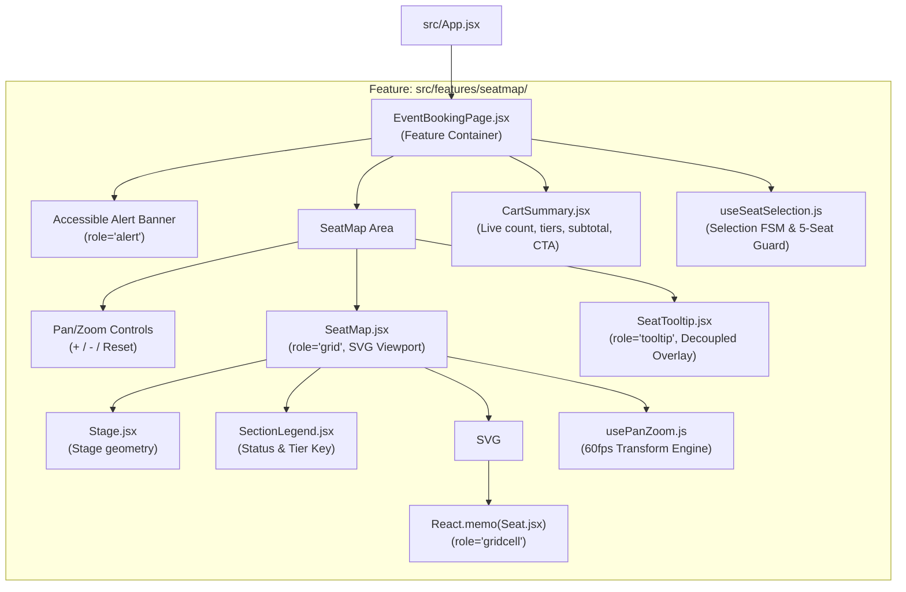
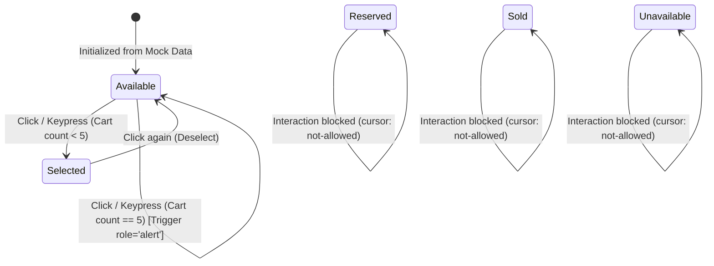

# Implementation Plan: SPEC-01 Interactive SVG Seating Map & Cart Summary

**Feature Code:** `FEAT-SEAT-01`  
**Specification Reference:** [`docs/ai-sdlc/specs/SPEC-01-interactive-seating-map.md`](file:///f:/SHADI/2-Programming/Interactive%20Event%20Ticketing%20Platform/interactive-event-ticketing-platform/docs/ai-sdlc/specs/SPEC-01-interactive-seating-map.md)  
**Parent Intent:** [`intent/interactive-event-ticketing.md`](file:///f:/SHADI/2-Programming/Interactive%20Event%20Ticketing%20Platform/interactive-event-ticketing-platform/intent/interactive-event-ticketing.md)  
**Architecture Guidelines:** [`.agents/rules/guidelines.md`](file:///f:/SHADI/2-Programming/Interactive%20Event%20Ticketing%20Platform/interactive-event-ticketing-platform/.agents/rules/guidelines.md), [`.agents/rules/ticketing-domain.md`](file:///f:/SHADI/2-Programming/Interactive%20Event%20Ticketing%20Platform/interactive-event-ticketing-platform/.agents/rules/ticketing-domain.md), [`.agents/skills/scaffold-feature/SKILL.md`](file:///f:/SHADI/2-Programming/Interactive%20Event%20Ticketing%20Platform/interactive-event-ticketing-platform/.agents/skills/scaffold-feature/SKILL.md)  
**Status:** Ready for Implementation  
**Estimated Touchpoints:** 3 existing files modified, 11 new feature/test files created  

---

## 1. Executive Summary & Specification Scope

The objective of this plan is to implement the **Interactive SVG Seating Map and Cart Summary** (`FEAT-SEAT-01`) meeting all functional, accessibility, and performance requirements specified in [`SPEC-01-interactive-seating-map.md`](file:///f:/SHADI/2-Programming/Interactive%20Event%20Ticketing%20Platform/interactive-event-ticketing-platform/docs/ai-sdlc/specs/SPEC-01-interactive-seating-map.md).

### Core Boundaries & Performance Benchmarks
1. **SVG Venue Topology:** Render an interactive SVG map representing a 520-seat auditorium ("Grand Symphony Hall") with stage area and three distinct tier sections (VIP, Regular, Balcony).
2. **60fps Render Performance & React.memo:**
   - 520 seat elements rendered via `<circle>` primitives wrapped in `React.memo`.
   - Tooltip state managed outside the SVG seat tree via pointer delegation, guaranteeing that moving the cursor over seats does **not** re-render the 520 seat nodes (`renderCount == 1`).
   - Pan & Zoom engine utilizing CSS/SVG matrix transformations throttled with `requestAnimationFrame` for stutter-free 60fps interaction on mouse drag, wheel, and multi-touch gestures.
3. **Visual Tokens & States:**
   - `available`: Emerald-500 (`#10B981`), pointer cursor
   - `selected`: Blue-600 (`#2563EB`), pointer cursor
   - `reserved`: Amber-500 (`#F59E0B`), not-allowed cursor
   - `sold`: Gray-400 (`#9CA3AF`), not-allowed cursor
   - `unavailable`: Gray-200 (`#E5E7EB`), not-allowed cursor
4. **Live Cart Summary & 5-Seat Limit Guard:**
   - Real-time aggregation of selected seats, tier breakdown (e.g., `VIP (1), Regular (1)`), and currency formatted subtotal (e.g., `$235.00`).
   - Hard booking ceiling of 5 seats per transaction. Selecting a 6th seat is blocked with an accessible inline alert banner (`role="alert"`: *"Maximum of 5 seats allowed per booking."*).
   - "Proceed to Checkout" CTA button dynamically enabled when `selectedSeats.length > 0`.
5. **Accessibility (WCAG 2.1 AA):**
   - Full keyboard navigation: Arrow keys navigate between adjacent grid seats; `Enter` and `Space` toggle selection.
   - Screen reader attributes: `role="grid"`, `role="row"`, `role="gridcell"`, `tabIndex`, and descriptive `aria-label` / `aria-selected` attributes.

---

## 2. Architecture & Design Blueprint

### 2.1 Component Hierarchy & Data Flow



### 2.2 Decoupled Tooltip Architecture (Avoiding 520 Re-renders)

To satisfy `REQ-SEAT-01.2` and verify the acceptance criterion where hovering over a seat triggers a tooltip without re-rendering the seat map:
1. Individual `Seat` elements carry data attributes (`data-seat-id`, `data-row`, `data-number`, `data-category`, `data-price`, `data-status`).
2. The parent `SeatMap` attaches a delegated `onPointerOver` and `onPointerOut` listener on the SVG container (or seat elements pass a lightweight callback `onSeatHover(seat, clientRect)`).
3. The tooltip state `{ visible, seat, x, y }` resides in a lightweight overlay component positioned absolutely above the SVG canvas.
4. Because the `Seat` components are wrapped in `React.memo` and do not consume the tooltip state, triggering or dismissing a tooltip causes 0 re-renders of the 520 seat SVG elements.

### 2.3 Finite State Machine (Seat Selection & Cart)



---

## 3. Venue Layout & Fixture Data Contract (520 Seats)

To strictly satisfy the test requirement `expect(screen.getAllByRole('gridcell')).toHaveLength(520);`, the layout fixture `mockVenueLayout.js` configures the Grand Symphony Hall topology with exactly 520 seats:

```javascript
// Data Topology Breakdown:
// 1. Orchestra VIP: 5 rows (A, B, C, D, E) × 24 seats = 120 seats ($150.00 each)
// 2. Mezzanine Regular: 8 rows (F, G, H, I, J, K, L, M) × 30 seats = 240 seats ($85.00 each)
// 3. Upper Balcony: 5 rows (N, O, P, Q, R) × 32 seats = 160 seats ($45.00 each)
// Total Seats: 120 + 240 + 160 = 520 seats.
```

### Sample Layout JSON Structure:
```json
{
  "venueId": "00000000-0000-0000-0000-000000000001",
  "name": "Grand Symphony Hall",
  "viewBox": "0 0 1400 950",
  "stage": {
    "label": "STAGE / PERFORMANCE AREA",
    "x": 350,
    "y": 40,
    "width": 700,
    "height": 70
  },
  "sections": [
    {
      "id": "sec-vip",
      "name": "Orchestra VIP",
      "category": "VIP",
      "defaultPrice": 150.00,
      "colorTheme": "#10B981",
      "rows": [
        { "rowLabel": "A", "seats": 24, "startX": 220, "startY": 160, "spacing": 40 },
        { "rowLabel": "B", "seats": 24, "startX": 220, "startY": 200, "spacing": 40 },
        { "rowLabel": "C", "seats": 24, "startX": 220, "startY": 240, "spacing": 40 },
        { "rowLabel": "D", "seats": 24, "startX": 220, "startY": 280, "spacing": 40 },
        { "rowLabel": "E", "seats": 24, "startX": 220, "startY": 320, "spacing": 40 }
      ]
    },
    {
      "id": "sec-reg",
      "name": "Mezzanine Regular",
      "category": "Regular",
      "defaultPrice": 85.00,
      "colorTheme": "#3B82F6",
      "rows": [
        { "rowLabel": "F", "seats": 30, "startX": 100, "startY": 400, "spacing": 40 },
        { "rowLabel": "G", "seats": 30, "startX": 100, "startY": 440, "spacing": 40 },
        { "rowLabel": "H", "seats": 30, "startX": 100, "startY": 480, "spacing": 40 },
        { "rowLabel": "I", "seats": 30, "startX": 100, "startY": 520, "spacing": 40 },
        { "rowLabel": "J", "seats": 30, "startX": 100, "startY": 560, "spacing": 40 },
        { "rowLabel": "K", "seats": 30, "startX": 100, "startY": 600, "spacing": 40 },
        { "rowLabel": "L", "seats": 30, "startX": 100, "startY": 640, "spacing": 40 },
        { "rowLabel": "M", "seats": 30, "startX": 100, "startY": 680, "spacing": 40 }
      ]
    },
    {
      "id": "sec-balc",
      "name": "Upper Balcony",
      "category": "Balcony",
      "defaultPrice": 45.00,
      "colorTheme": "#8B5CF6",
      "rows": [
        { "rowLabel": "N", "seats": 32, "startX": 60, "startY": 760, "spacing": 40 },
        { "rowLabel": "O", "seats": 32, "startX": 60, "startY": 800, "spacing": 40 },
        { "rowLabel": "P", "seats": 32, "startX": 60, "startY": 840, "spacing": 40 },
        { "rowLabel": "Q", "seats": 32, "startX": 60, "startY": 880, "spacing": 40 },
        { "rowLabel": "R", "seats": 32, "startX": 60, "startY": 920, "spacing": 40 }
      ]
    }
  ]
}
```

---

## 4. Minimal Changes & File Scaffolding Plan

Adhering strictly to `.agents/skills/scaffold-feature/SKILL.md` and the policy of reusing existing resources before adding packages:

### 4.1 Dependency Additions (Testing Only)
No runtime packages are added. React 19 and native browser APIs handle SVG, transforms, and interactions. We only add standard testing dependencies in `devDependencies`:
- `vitest`: Unit/integration test runner
- `@testing-library/react`: React testing utility
- `@testing-library/jest-dom`: DOM assertion matchers (`toHaveAttribute`, `toBeInTheDocument`, etc.)
- `@testing-library/user-event`: User interaction simulations
- `jsdom`: Headless DOM environment for Vitest

### 4.2 Files to Create & Modify

| File Path | Action | Description |
| :--- | :--- | :--- |
| `package.json` | Modify | Add `devDependencies` (`vitest`, testing-library) and `"test"` script. |
| `vite.config.js` | Modify | Add `test` configuration block (`environment: 'jsdom'`, `setupFiles`). |
| `tests/setup.js` | Create | Testing Library Jest DOM matcher setup. |
| `src/features/seatmap/index.js` | Create | Feature public exports (`SeatMap`, `EventBookingPage`, hooks). |
| `src/features/seatmap/EventBookingPage.jsx` | Create | Main container component integrating SeatMap, alerts, and CartSummary. |
| `src/features/seatmap/SeatMap.jsx` | Create | SVG grid component with pan/zoom viewport, stage, row groupings, and memoized seats. |
| `src/features/seatmap/SeatMap.css` | Create | Scoped CSS styles for map container, pan/zoom transitions, tooltips, and cart. |
| `src/features/seatmap/components/Seat.jsx` | Create | Memoized SVG seat component (`<circle>`) with accessibility attributes (`role="gridcell"`). |
| `src/features/seatmap/components/SeatTooltip.jsx` | Create | Decoupled tooltip overlay (`role="tooltip"`). |
| `src/features/seatmap/components/Stage.jsx` | Create | SVG Stage representation. |
| `src/features/seatmap/components/CartSummary.jsx` | Create | Live cart summary displaying count, tier breakdown, subtotal, and checkout CTA. |
| `src/features/seatmap/components/SectionLegend.jsx` | Create | Visual legend showing status colors and tier pricing. |
| `src/features/seatmap/hooks/useSeatSelection.js` | Create | Cart state machine hook enforcing 5-seat limit, subtotal calculation, and inline alerts. |
| `src/features/seatmap/hooks/usePanZoom.js` | Create | Native 60fps pan & zoom hook with pointer/wheel handlers and reset controls. |
| `src/features/seatmap/services/mockTicketingService.js` | Create | Implementation of `ITicketingService` contract providing deterministic venue & seat data. |
| `src/features/seatmap/data/mockVenueLayout.js` | Create | 520-seat layout configuration and seat generator fixture. |
| `src/features/seatmap/utils/formatters.js` | Create | Currency and seat label formatting utility. |
| `src/App.jsx` | Modify | Mount `<EventBookingPage />` in place of starter boilerplate. |
| `tests/components/SeatMap.test.jsx` | Create | SVG layout render (520 seats), status colors, tooltip, and memoization verification. |
| `tests/features/cart.test.jsx` | Create | Cart aggregation, tier breakdown, 5-seat limit alert, and deselection verification. |
| `tests/components/SeatMapA11y.test.jsx` | Create | Keyboard navigation (arrow keys, Enter/Space), ARIA roles, and attributes verification. |

---

## 5. Detailed Implementation Steps

### Phase 1: Environment & Test Harness Configuration
1. Update `package.json` to include:
   ```json
   "scripts": {
     "test": "vitest",
     "test:run": "vitest run"
   },
   "devDependencies": {
     "@testing-library/jest-dom": "^6.6.3",
     "@testing-library/react": "^16.2.0",
     "@testing-library/user-event": "^14.6.1",
     "jsdom": "^26.0.0",
     "vitest": "^3.0.7"
   }
   ```
2. Update `vite.config.js`:
   ```javascript
   export default defineConfig({
     plugins: [react()],
     test: {
       globals: true,
       environment: 'jsdom',
       setupFiles: './tests/setup.js',
     },
   })
   ```
3. Create `tests/setup.js` importing `@testing-library/jest-dom`.

### Phase 2: Domain Data, Utilities & Service Contracts
1. Create `src/features/seatmap/utils/formatters.js`:
   - `formatCurrency(amount)`: Formats number to `$XX.XX`.
   - `formatSeatLabel(row, number)`: Formats seat designation (e.g. `A-12`).
2. Create `src/features/seatmap/data/mockVenueLayout.js`:
   - Exports `mockVenueLayout` (JSON structure from Section 3, 520 seats total).
   - Exports `generateSeats(layout)`: Generates 520 initial seat objects with default status `available`, pre-seeding a few `reserved` (e.g., B-1, B-2) and `sold` (e.g., C-1, C-2) seats for testing visual tokens.
3. Create `src/features/seatmap/services/mockTicketingService.js`:
   - Implements `getVenueLayout(venueId)` and `getSeatAvailability(eventId)`.

### Phase 3: Custom Hooks
1. Create `src/features/seatmap/hooks/useSeatSelection.js`:
   - State: `selectedSeats` (array of seat objects), `alertMessage` (string | null).
   - Functions:
     - `toggleSeat(seat)`:
       - If seat is not `available` and not `selected`: Ignore.
       - If seat is already `selected`: Deselect it, remove from `selectedSeats`, clear alert message.
       - If seat is `available`:
         - If `selectedSeats.length >= 5`: Set `alertMessage = 'Maximum of 5 seats allowed per booking.'`. Do not select seat.
         - Else: Add seat to `selectedSeats`, clear alert message.
     - `clearSelection()`: Resets selection.
   - Computed properties:
     - `seatCount = selectedSeats.length`
     - `subtotal = selectedSeats.reduce((sum, s) => sum + s.price, 0)`
     - `tierSummary = { VIP: count, Regular: count, Balcony: count }`
     - `isLimitReached = selectedSeats.length >= 5`
2. Create `src/features/seatmap/hooks/usePanZoom.js`:
   - State: `transform = { x: 0, y: 0, scale: 1 }`.
   - Actions: `zoomIn`, `zoomOut`, `resetTransform`, `onPointerDown`, `onPointerMove`, `onPointerUp`, `onWheel`.
   - Throttled with `requestAnimationFrame` for guaranteed 60fps performance without external libraries.

### Phase 4: Memoized & Presentational Subcomponents
1. Create `src/features/seatmap/components/Seat.jsx`:
   - Memoized via `React.memo(Seat, (prev, next) => prev.status === next.status && prev.isSelected === next.isSelected && prev.isFocused === next.isFocused)`.
   - Props: `seat`, `isSelected`, `isFocused`, `onSelect`, `onHover`, `onHoverLeave`, `onFocus`.
   - Renders `<circle>` or `<rect>` with:
     - `role="gridcell"`
     - `data-seat-id={seat.id}`
     - `data-testid={seat.id}`
     - `tabIndex={seat.status === 'available' ? 0 : -1}`
     - `fill={isSelected ? '#2563EB' : statusColor}`
     - `cursor={isInteractive ? 'pointer' : 'not-allowed'}`
     - `aria-label={`Seat ${seat.rowLabel}${seat.seatNumber}, Category: ${seat.category}, Price: $${seat.price.toFixed(2)}, Status: ${isSelected ? 'selected' : seat.status}`}`
     - `aria-selected={isSelected}`
2. Create `src/features/seatmap/components/SeatTooltip.jsx`:
   - Renders floating container (`role="tooltip"`) absolutely positioned based on cursor/seat bounding rect.
   - Displays Row, Seat Number, Category, and Price (e.g. `VIP - $150.00`).
3. Create `src/features/seatmap/components/Stage.jsx`:
   - Renders SVG rect and text for `"STAGE / PERFORMANCE AREA"`.
4. Create `src/features/seatmap/components/CartSummary.jsx`:
   - Renders cart header, seat count badge (`data-testid="cart-seat-count"`), itemized tier breakdown, subtotal (`data-testid="cart-subtotal"`), and "Proceed to Checkout" button (`disabled={seatCount === 0}`).
5. Create `src/features/seatmap/components/SectionLegend.jsx`:
   - Visual key for status colors (`Available: #10B981`, `Selected: #2563EB`, `Reserved: #F59E0B`, `Sold: #9CA3AF`) and categories.

### Phase 5: Container Components & Accessibility Grid
1. Create `src/features/seatmap/SeatMap.jsx`:
   - Renders root container with `role="grid"` and `aria-label="Venue seating plan"`.
   - Renders SVG element with `viewBox={layout.viewBox}` and inner `<g transform="...">` powered by `usePanZoom`.
   - Renders rows wrapped in `<g role="row" aria-label={`Row ${rowLabel}`}>`.
   - Attaches keyboard listener for arrow key navigation:
     - Calculates adjacent seat (left/right by number, up/down by row).
     - Updates focused seat ID and shifts DOM focus to the target seat element.
     - Handles `Enter` and `Space` keypresses to trigger selection toggle.
   - Manages tooltip coordinate state without triggering seat re-renders.
2. Create `src/features/seatmap/EventBookingPage.jsx`:
   - Composes `SeatMap`, `CartSummary`, and the accessible alert banner (`role="alert"`).
   - Feeds `useSeatSelection` state into `SeatMap` and `CartSummary`.
3. Create `src/features/seatmap/SeatMap.css`:
   - Modern, responsive styling with clean transitions, flex/grid layout, and accessible high-contrast focus rings.
4. Create `src/features/seatmap/index.js`:
   - Clean public exports.

### Phase 6: Root App Mount & Verification
1. Update `src/App.jsx` to render `<EventBookingPage />`.
2. Run test suites (`npm run test:run`) and linter (`npm run lint`).
3. Verify visual build (`npm run build`).

---

## 6. Verification & Automated Test Matrix

The test suite directly maps to the formal acceptance criteria in `SPEC-01`:

| Acceptance Criteria / Scenario | Target Test File | Test Case Description | Key Assertions |
| :--- | :--- | :--- | :--- |
| **Scenario 1.1: 520 Seats Render** | `tests/components/SeatMap.test.jsx` | Mounts `SeatMap` with 520-seat fixture | `expect(screen.getAllByRole('gridcell')).toHaveLength(520);` |
| **Scenario 1.1: Visual Tokens** | `tests/components/SeatMap.test.jsx` | Checks fill colors & cursors for `available`, `reserved`, `sold`, `selected` | `expect(availableSeat).toHaveAttribute('fill', '#10B981');`<br>`expect(reservedSeat).toHaveAttribute('fill', '#F59E0B');`<br>`expect(soldSeat).toHaveAttribute('fill', '#9CA3AF');` |
| **Scenario 1.1: Tooltip Hover & No Re-render** | `tests/components/SeatMap.test.jsx` | Simulates `pointerOver` on seat; asserts tooltip appears without re-rendering seat nodes | `expect(screen.getByRole('tooltip')).toHaveTextContent('VIP - $150.00');`<br>`expect(seatMapRenderSpy).toHaveBeenCalledTimes(1);` |
| **Scenario 1.2: Multi-Seat Cart Aggregation** | `tests/features/cart.test.jsx` | Selects A-1 ($150) and D-5 ($85) | `expect(screen.getByTestId('cart-seat-count')).toHaveTextContent('2');`<br>`expect(screen.getByTestId('cart-subtotal')).toHaveTextContent('$235.00');`<br>`expect(screen.getByRole('button', { name: /Proceed to Checkout/i })).toBeEnabled();` |
| **Scenario 1.3: 5-Seat Hard Limit Alert** | `tests/features/cart.test.jsx` | Selects 5 seats, then clicks 6th available seat | `expect(screen.getByRole('alert')).toHaveTextContent('Maximum of 5 seats allowed per booking.');`<br>`expect(screen.getByTestId('cart-seat-count')).toHaveTextContent('5');`<br>`expect(sixthSeat).toHaveAttribute('fill', '#10B981');` |
| **Scenario 1.4: Seat Deselection** | `tests/features/cart.test.jsx` | Selects B-3 and B-4 ($300 total), clicks B-4 again | `expect(seatB4).toHaveAttribute('fill', '#10B981');`<br>`expect(screen.getByTestId('cart-seat-count')).toHaveTextContent('1');`<br>`expect(screen.getByTestId('cart-subtotal')).toHaveTextContent('$150.00');` |
| **A11y: Roles & Grid Semantics** | `tests/components/SeatMapA11y.test.jsx` | Validates container `role="grid"` and row `role="row"` | `expect(screen.getByRole('grid')).toHaveAttribute('aria-label', 'Venue seating plan');`<br>`expect(screen.getAllByRole('row')).toHaveLength(18);` |
| **A11y: Keyboard Navigation** | `tests/components/SeatMapA11y.test.jsx` | Focuses A-1, fires `ArrowRight`, presses `Enter` | `expect(document.activeElement).toHaveAttribute('data-seat-id', 'A-2');`<br>`expect(screen.getByTestId('A-2')).toHaveAttribute('aria-selected', 'true');` |
| **A11y: Space Key Toggle** | `tests/components/SeatMapA11y.test.jsx` | Presses `Space` on active seat cell | Seat selection toggles between selected and unselected |

---

## 7. Performance & 60fps Benchmark Strategy

1. **SVG DOM Optimization:**
   - 520 SVG nodes is well within modern browser DOM budgets, but SVG layout thrashing is avoided by keeping geometry static (`cx`, `cy`, `r`).
   - Fill changes are handled directly via SVG attributes rather than heavy CSS animations.
2. **Pointer Delegation for Tooltips:**
   - Instead of attaching 520 mouse event listeners with inline closures, pointer events are delegated or pass static identifiers.
   - The tooltip component is rendered as an isolated absolute HTML element overlaying the SVG, preventing the SVG DOM tree from triggering browser reflows.
3. **Hardware-Accelerated Pan & Zoom:**
   - Pointer drag updates SVG `<g transform="translate(x, y) scale(scale)">`.
   - State updates during active drag use `requestAnimationFrame` scheduling to prevent dropped frames and maintain 60fps.

---

## 8. Rollback & Recovery Plan

In the event that the implementation needs to be reverted or encounters fatal regressions:

### Step 1: Revert Code Changes
```bash
# Revert modified files to main branch state
git checkout HEAD -- package.json package-lock.json vite.config.js src/App.jsx

# Remove created feature files
rm -rf src/features/seatmap tests/
```

### Step 2: Reinstall Clean Dependencies
```bash
# Reinstall pristine dependencies without test runner additions
npm install
```

### Step 3: Verification of Clean State
```bash
# Verify clean compilation and linting
npm run lint
npm run build
```
This restores the repository to its baseline state without residual artifacts.
