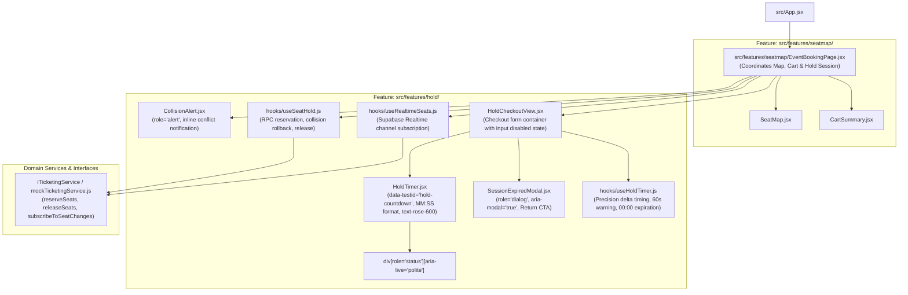

# Implementation Plan: SPEC-02 Concurrency Control, Realtime Sync & 5-Minute Hold Timer

**Feature Code:** `FEAT-HOLD-02`  
**Specification Reference:** [`docs/ai-sdlc/specs/SPEC-02-concurrency-and-seat-hold.md`](file:///f:/SHADI/2-Programming/Interactive%20Event%20Ticketing%20Platform/interactive-event-ticketing-platform/docs/ai-sdlc/specs/SPEC-02-concurrency-and-seat-hold.md)  
**Parent Intent:** [`intent/interactive-event-ticketing.md`](file:///f:/SHADI/2-Programming/Interactive%20Event%20Ticketing%20Platform/interactive-event-ticketing-platform/intent/interactive-event-ticketing.md)  
**Architecture Guidelines:** [`.agents/rules/guidelines.md`](file:///f:/SHADI/2-Programming/Interactive%20Event%20Ticketing%20Platform/interactive-event-ticketing-platform/.agents/rules/guidelines.md), [`.agents/rules/ticketing-domain.md`](file:///f:/SHADI/2-Programming/Interactive%20Event%20Ticketing%20Platform/interactive-event-ticketing-platform/.agents/rules/ticketing-domain.md), [`.agents/skills/scaffold-feature/SKILL.md`](file:///f:/SHADI/2-Programming/Interactive%20Event%20Ticketing%20Platform/interactive-event-ticketing-platform/.agents/skills/scaffold-feature/SKILL.md)  
**Status:** Ready for Implementation  
**Estimated Touchpoints:** 3 existing files modified, 10 new feature files, 1 SQL migration, 3 test suites created  

---

## 1. Executive Summary & Specification Scope

The objective of this plan is to implement the **Concurrency Control, Supabase Realtime Synchronization, and 5-Minute Hold Countdown Timer** (`FEAT-HOLD-02`) satisfying all functional requirements, architectural boundaries, and acceptance criteria defined in [`SPEC-02-concurrency-and-seat-hold.md`](file:///f:/SHADI/2-Programming/Interactive%20Event%20Ticketing%20Platform/interactive-event-ticketing-platform/docs/ai-sdlc/specs/SPEC-02-concurrency-and-seat-hold.md).

### 1.1 Intent Traceability & Core Requirements

| Requirement ID | Intent Line Reference | Description & Architectural Boundary |
| :--- | :--- | :--- |
| `REQ-HOLD-02.1` | [L49-L53](file:///f:/SHADI/2-Programming/Interactive%20Event%20Ticketing%20Platform/interactive-event-ticketing-platform/intent/interactive-event-ticketing.md#L49-L53), [L113-L145](file:///f:/SHADI/2-Programming/Interactive%20Event%20Ticketing%20Platform/interactive-event-ticketing-platform/intent/interactive-event-ticketing.md#L113-L145) | **Atomic Temporary Lock (RPC):** PostgreSQL RPC `reserve_seats(eventId, seatIds, userId, 300)` acquires row-level locks via `FOR UPDATE`. If any seat is unavailable, transaction safely rolls back with `SEATS_UNAVAILABLE` without partial reservations. |
| `REQ-HOLD-02.2` | [L53](file:///f:/SHADI/2-Programming/Interactive%20Event%20Ticketing%20Platform/interactive-event-ticketing-platform/intent/interactive-event-ticketing.md#L53), [L111](file:///f:/SHADI/2-Programming/Interactive%20Event%20Ticketing%20Platform/interactive-event-ticketing-platform/intent/interactive-event-ticketing.md#L111) | **Realtime Seat Synchronization:** Broadcasts `UPDATE` events on `seats` table via Supabase Realtime channel `event-seats-{eventId}`. Reflects status changes to `reserved` (`#F59E0B`, Amber) across all connected clients within $\le 200\text{ms}$. |
| `REQ-HOLD-02.3` | [L54](file:///f:/SHADI/2-Programming/Interactive%20Event%20Ticketing%20Platform/interactive-event-ticketing-platform/intent/interactive-event-ticketing.md#L54), [L118](file:///f:/SHADI/2-Programming/Interactive%20Event%20Ticketing%20Platform/interactive-event-ticketing-platform/intent/interactive-event-ticketing.md#L118) | **Precision 300-Second Hold Countdown Timer:** Launches immediately upon hold acquisition. Synchronizes against server `reserved_until` (`Date.parse(reserved_until) - Date.now()`) to eliminate client clock drift. Shifts to warning style (`text-rose-600`) at $\le 60$ seconds with screen reader announcement. |
| `REQ-HOLD-02.4` | [L56-L63](file:///f:/SHADI/2-Programming/Interactive%20Event%20Ticketing%20Platform/interactive-event-ticketing-platform/intent/interactive-event-ticketing.md#L56-L63), [L146](file:///f:/SHADI/2-Programming/Interactive%20Event%20Ticketing%20Platform/interactive-event-ticketing-platform/intent/interactive-event-ticketing.md#L146) | **Expiration Handshake & Cleanup:** At `00:00`, invalidates checkout session, calls `releaseSeats(eventId, seatIds, userId)` RPC, disables form inputs and payment CTA, displays blocking `<SessionExpiredModal />`, and redirects back to venue map where seats return to `available` (`#10B981`, Emerald). |

---

## 2. Technical Architecture & Protocols

### 2.1 Atomic Concurrency Protocol (`reserve_seats` & `release_seats` RPCs)

To guarantee ACID guarantees under high contention (multiple concurrent users competing for the same front-row seats):

1. **Pessimistic Row-Level Locking:**
   - Uses PostgreSQL `SELECT id FROM seats ... FOR UPDATE` over the set of requested seat IDs.
   - Any concurrent transaction attempting to read-for-update or update the same rows blocks until the first transaction commits or rolls back.
2. **All-or-Nothing Atomic Validation:**
   - Evaluates `COUNT(*) = array_length(p_seat_ids, 1)`. If even one seat was already locked or sold, the transaction exits early, releasing locks and returning `{ success: false, error_code: 'SEATS_UNAVAILABLE', message: 'One or more requested seats are no longer available.' }`.
3. **Deterministic Lock Expiration:**
   - Computes `v_expires_at := NOW() + (p_hold_duration_seconds || ' seconds')::INTERVAL`.
   - Records `status = 'reserved'`, `reserved_by = p_user_id`, and `reserved_until = v_expires_at`.
4. **Explicit Release RPC (`release_seats`):**
   - Atomically releases held seats belonging to the user back to `status = 'available'`, setting `reserved_by = NULL` and `reserved_until = NULL`.

```sql
-- Migration: supabase/migrations/20261003_02_concurrency_and_seat_hold.sql

CREATE OR REPLACE FUNCTION reserve_seats(
  p_event_id UUID,
  p_seat_ids UUID[],
  p_user_id UUID,
  p_hold_duration_seconds INT DEFAULT 300
) RETURNS JSONB
LANGUAGE plpgsql
SECURITY DEFINER
AS $$
DECLARE
  v_available_count INT;
  v_expires_at TIMESTAMPTZ;
BEGIN
  v_expires_at := NOW() + (p_hold_duration_seconds || ' seconds')::INTERVAL;

  -- 1. Pessimistic row-level lock on available seats matching IDs
  PERFORM id FROM seats
  WHERE id = ANY(p_seat_ids)
    AND event_id = p_event_id
    AND status = 'available'
  FOR UPDATE;

  -- 2. Verify all requested seats were locked
  SELECT COUNT(*) INTO v_available_count
  FROM seats
  WHERE id = ANY(p_seat_ids)
    AND event_id = p_event_id
    AND status = 'available';

  IF v_available_count <> array_length(p_seat_ids, 1) THEN
    RETURN jsonb_build_object(
      'success', false,
      'error_code', 'SEATS_UNAVAILABLE',
      'message', 'One or more requested seats are no longer available.'
    );
  END IF;

  -- 3. Atomic state transition
  UPDATE seats
  SET status = 'reserved',
      reserved_by = p_user_id,
      reserved_until = v_expires_at,
      updated_at = NOW()
  WHERE id = ANY(p_seat_ids);

  RETURN jsonb_build_object(
    'success', true,
    'reserved_seat_ids', p_seat_ids,
    'reserved_until', v_expires_at
  );
END;
$$;

CREATE OR REPLACE FUNCTION release_seats(
  p_event_id UUID,
  p_seat_ids UUID[],
  p_user_id UUID
) RETURNS JSONB
LANGUAGE plpgsql
SECURITY DEFINER
AS $$
BEGIN
  UPDATE seats
  SET status = 'available',
      reserved_by = NULL,
      reserved_until = NULL,
      updated_at = NOW()
  WHERE id = ANY(p_seat_ids)
    AND event_id = p_event_id
    AND status = 'reserved'
    AND (reserved_by = p_user_id OR reserved_until <= NOW());

  RETURN jsonb_build_object(
    'success', true,
    'released_seat_ids', p_seat_ids
  );
END;
$$;
```

### 2.2 Supabase Realtime Subscription Protocol

All active viewers of an event seating map subscribe to real-time seat mutations:

```typescript
// Subscription lifecycle in useRealtimeSeats hook:
const channel = supabase
  .channel(`event-seats-${eventId}`)
  .on(
    'postgres_changes',
    {
      event: 'UPDATE',
      schema: 'public',
      table: 'seats',
      filter: `event_id=eq.${eventId}`
    },
    (payload) => {
      // payload.new contains updated seat record: id, status, reserved_by, etc.
      onSeatUpdate(payload.new as SeatRecord);
    }
  )
  .subscribe();
```

- **Latency Guarantee:** Realtime WebSocket broadcast propagation occurs within $\le 200\text{ms}$.
- **Conflict Handling in View:** When a collision occurs, the incoming payload immediately triggers a status color transition to `#F59E0B` (Amber) on the loser's screen while an accessible alert banner is presented.

### 2.3 Precision Hold Timer & Clock Drift Protection

Client clocks can drift by seconds or minutes. To prevent false timeouts or premature expiration:

1. **Server Reference Anchor:**
   - The RPC returns the authoritative server ISO timestamp: `reserved_until` (e.g. `2026-10-03T12:05:00.000Z`).
2. **Delta Calculation:**
   ```javascript
   const computeRemainingSeconds = (reservedUntilIso) => {
     const expiryEpoch = Date.parse(reservedUntilIso);
     const nowEpoch = Date.now();
     const diffMs = expiryEpoch - nowEpoch;
     return Math.max(0, Math.floor(diffMs / 1000));
   };
   ```
3. **Heartbeat Interval:**
   - Uses `setInterval(tick, 1000)` that recalculates the delta from `Date.now()` on every tick rather than naive decrementing (`remaining - 1`), eliminating interval skew or background tab throttle errors.
4. **Visual Warning & Accessibility Announcement ($\le 60\text{s}$):**
   - At `remainingSeconds <= 60`:
     - Visual token switches to `text-rose-600` (`#E11D48`) and adds a subtle pulse animation.
     - Live region (`aria-live="polite"` or `role="status"`) announces:
       `"1 minute remaining to complete your booking"`.
5. **Session Expiration Handshake ($00:00$):**
   - When `remainingSeconds === 0`:
     - Invokes `releaseSeats(eventId, seatIds, userId)`.
     - Invalidates session state (`isExpired: true`).
     - Disables all form inputs and action buttons in checkout view.
     - Mounts blocking `<SessionExpiredModal />`.
     - Clicking "Return to Seat Map" redirects back to the seating map view, where released seats are displayed as `available` (`#10B981`, Green).

---

## 3. Finite State Machine & State Transition Matrix

```mermaid
stateDiagram-v2
    [*] --> Idle : Seat Selection Complete in Map
    Idle --> Locking : User clicks 'Proceed to Checkout'
    
    Locking --> Conflict : RPC returns SEATS_UNAVAILABLE
    Conflict --> Idle : Display inline collision alert; Seat turns Amber (#F59E0B)
    
    Locking --> Held : RPC success (Seats locked, reserved_until returned)
    
    state Held {
        [*] --> ActiveTimer : 300s > remaining > 60s
        ActiveTimer --> WarningTimer : remaining <= 60s (text-rose-600 & a11y announcement)
        WarningTimer --> Expired : remaining == 0s (Handshake triggered)
    }

    Held --> PaymentProcessing : User Submits Valid Payment Form (SPEC-04)
    PaymentProcessing --> Confirmed : Payment 200 OK (Seats -> Sold)
    PaymentProcessing --> Held : Payment Failed (Timer continues without reset)

    Expired --> InvalidationCleanup : Auto-call releaseSeats() & disable checkout inputs
    InvalidationCleanup --> ModalAlert : Render blocking <SessionExpiredModal />
    ModalAlert --> Idle : User clicks 'Return to Seat Map' -> Route to map (Seats -> Green)
```



### State Transition Matrix

| Current State | Event / Trigger | Guard / Condition | Target State | Actions & Side Effects |
| :--- | :--- | :--- | :--- | :--- |
| `Idle` | `PROCEED_TO_CHECKOUT` | `selectedSeats.length > 0` | `Locking` | Invoke `reserveSeats(eventId, seatIds, userId, 300)` RPC. |
| `Locking` | `RPC_SUCCESS` | All seats locked | `Held.ActiveTimer` | Transition view to checkout; set `reserved_until`; initialize precision 300s timer. |
| `Locking` | `RPC_FAILURE` | Any seat unavailable (`SEATS_UNAVAILABLE`) | `Conflict` | Keep user on map; mark conflicted seat `reserved` (`#F59E0B`); show inline alert. |
| `Conflict` | `DISMISS_ALERT` | User acknowledges / deselects | `Idle` | Update local selection; clear collision banner. |
| `Held.ActiveTimer` | `TICK` | `remaining <= 60` | `Held.WarningTimer` | Apply `text-rose-600` styling; trigger screen-reader announcement. |
| `Held.WarningTimer`| `TICK` | `remaining == 0` | `Expired` | Invalidate checkout session; invoke `releaseSeats` RPC; disable inputs; open modal. |
| `Held` | `SUBMIT_PAYMENT` | Form valid | `PaymentProcessing` | Disable inputs; delegate to payment confirmation service. |
| `PaymentProcessing`| `PAYMENT_SUCCESS` | Gateway 200 OK | `Confirmed` | Seats marked `sold`; route to digital ticket receipt (SPEC-04). |
| `PaymentProcessing`| `PAYMENT_FAILURE` | Gateway 4xx/5xx | `Held` | Re-enable inputs; display payment error message; timer continues. |
| `Expired` | `CLICK_RETURN_CTA` | Modal CTA clicked | `Idle` | Navigate back to seat map; confirm seats render Green (`available`). |

---

## 4. Component Hierarchy & Architecture

Following `.agents/skills/scaffold-feature/SKILL.md`, all hold and concurrency features are scaffolded under `src/features/hold/`:



---

## 5. Minimal Changes & Scaffolding Breakdown

Adhering strictly to the principle of **minimal change** and **reusing existing resources before adding packages**:

### 5.1 Package Dependencies
- **No new runtime packages added.** React 19 native hooks (`useState`, `useEffect`, `useCallback`, `useRef`), standard browser `Date` APIs, and HTML5 dialog/accessibility attributes handle all timer and modal requirements.
- Standard test harness (`vitest`, `@testing-library/react`, `@testing-library/jest-dom`, `@testing-library/user-event`, `jsdom`) established in PLAN-01 is fully reused. Fake timers (`vi.useFakeTimers()`, `vi.advanceTimersByTime()`) provide deterministic timer simulation.

### 5.2 Files to Create & Modify

| File Path | Action | Description |
| :--- | :--- | :--- |
| `supabase/migrations/20261003_02_concurrency_and_seat_hold.sql` | Create | PostgreSQL schema update and stored procedures `reserve_seats` and `release_seats` with pessimistic row locking. |
| `src/features/hold/index.js` | Create | Feature public exports (`HoldTimer`, `SessionExpiredModal`, `CollisionAlert`, `HoldCheckoutView`, hooks). |
| `src/features/hold/HoldTimer.jsx` | Create | 300s countdown display (`MM:SS`), warning state (`text-rose-600`), screen-reader live region announcement. |
| `src/features/hold/SessionExpiredModal.jsx` | Create | Blocking modal (`role="dialog"`, `aria-modal="true"`) displayed at 00:00 with "Return to Seat Map" CTA. |
| `src/features/hold/CollisionAlert.jsx` | Create | Accessible banner (`role="alert"`) displayed when a seat reservation collision occurs. |
| `src/features/hold/HoldCheckoutView.jsx` | Create | Checkout step container rendering `HoldTimer`, mock payment form, disabled states on expiration, and expired modal. |
| `src/features/hold/Hold.css` | Create | Scoped CSS for timer badge, pulse warning animation, modal backdrop, and collision alerts. |
| `src/features/hold/hooks/useHoldTimer.js` | Create | Custom hook calculating precision remaining time from `reserved_until`, 60s warning detection, and expiration callback. |
| `src/features/hold/hooks/useSeatHold.js` | Create | Custom hook orchestrating `reserveSeats` RPC, `SEATS_UNAVAILABLE` collision handling, and `releaseSeats` calls. |
| `src/features/hold/hooks/useRealtimeSeats.js` | Create | Custom hook managing Supabase Realtime channel subscription and updating local seat availability. |
| `src/features/hold/utils/timeFormatters.js` | Create | Helper utilities: `formatTimeRemaining(seconds)` (`MM:SS`), `computeRemainingSeconds(reservedUntilIso)`. |
| `src/features/seatmap/services/mockTicketingService.js` | Modify | Implement `reserveSeats`, `releaseSeats`, and `subscribeToSeatChanges` adhering to `ITicketingService`. |
| `src/features/seatmap/EventBookingPage.jsx` | Modify | Wire up "Proceed to Checkout" to `useSeatHold.reserve()`, manage checkout view transition, show `CollisionAlert`, and listen to Realtime seat updates. |
| `tests/features/seat-hold.test.jsx` | Create | Automated tests for atomic lock RPC, collision rejection (`SEATS_UNAVAILABLE`), seat status updates, and inline alert. |
| `tests/integration/realtime.test.jsx` | Create | Integration tests for Realtime channel subscription and seat update propagation ($\le 200\text{ms}$). |
| `tests/features/hold-timer.test.jsx` | Create | Automated tests for timer countdown, clock drift protection, 60s warning style, and 00:00 expiration handshake. |

---

## 6. Detailed Implementation Steps

### Phase 1: Database RPC Migration & Domain Service Contract
1. **Create SQL Migration:**
   - File: `supabase/migrations/20261003_02_concurrency_and_seat_hold.sql`
   - Implement `reserve_seats(p_event_id, p_seat_ids, p_user_id, p_hold_duration_seconds)`.
   - Implement `release_seats(p_event_id, p_seat_ids, p_user_id)`.
   - Ensure partial locking is impossible by performing lock count comparison before executing `UPDATE`.
2. **Extend `mockTicketingService.js`:**
   - File: `src/features/seatmap/services/mockTicketingService.js`
   - Implement `reserveSeats(eventId, seatIds, userId, holdDurationSeconds)`:
     - Check current status of each seat ID.
     - If any seat is not `'available'`, return `{ success: false, error_code: 'SEATS_UNAVAILABLE', message: 'One or more requested seats are no longer available.' }`.
     - Otherwise, set status to `'reserved'`, `reserved_by = userId`, `reserved_until = new Date(Date.now() + (holdDurationSeconds || 300) * 1000).toISOString()`.
     - Notify subscribers via `subscribeToSeatChanges` listeners.
     - Return `{ success: true, reserved_seat_ids: seatIds, reserved_until: expiresAt }`.
   - Implement `releaseSeats(eventId, seatIds, userId)`:
     - Update status back to `'available'`, `reserved_by = null`, `reserved_until = null`.
     - Notify subscribers via `subscribeToSeatChanges` listeners.
     - Return `{ success: true, releasedSeatIds: seatIds }`.
   - Implement `subscribeToSeatChanges(eventId, onSeatUpdate)`:
     - Stores callback in an active listeners set.
     - Returns unsubscribe function removing the callback.

### Phase 2: Timing Utilities & Custom Hooks
1. **Create Time Formatting Utilities:**
   - File: `src/features/hold/utils/timeFormatters.js`
   - `formatTimeRemaining(seconds)`: Converts seconds to padded `MM:SS` string (e.g. `300 -> "05:00"`, `60 -> "01:00"`).
   - `computeRemainingSeconds(reservedUntilIso)`: Calculates `Math.max(0, Math.floor((Date.parse(reservedUntilIso) - Date.now()) / 1000))`.
2. **Create `useHoldTimer.js`:**
   - File: `src/features/hold/hooks/useHoldTimer.js`
   - Inputs: `{ reservedUntil, onExpire }`.
   - Internal state: `remainingSeconds` initialized from `computeRemainingSeconds(reservedUntil)`.
   - Tracks `hasAnnouncedWarning` ref to ensure the 60-second screen reader announcement triggers exactly once when crossing $\le 60\text{s}$.
   - Effects: Sets interval to update `remainingSeconds` on each tick.
   - When `remainingSeconds === 0`, invokes `onExpire()` and stops interval.
   - Returns: `{ remainingSeconds, formattedTime, isWarning: remainingSeconds <= 60 && remainingSeconds > 0, isExpired: remainingSeconds === 0, warningAnnouncement }`.
3. **Create `useSeatHold.js`:**
   - File: `src/features/hold/hooks/useSeatHold.js`
   - State: `isLocking`, `holdError`, `reservationData` (`{ reservedUntil, seatIds }`), `isExpired`.
   - Functions:
     - `reserve(eventId, seatIds, userId)`: Calls `mockTicketingService.reserveSeats`. On `SEATS_UNAVAILABLE`, sets `holdError` and returns failure without changing view. On success, clears errors and stores reservation.
     - `release(eventId, seatIds, userId)`: Calls `mockTicketingService.releaseSeats`.
     - `handleExpire()`: Sets `isExpired = true`, calls `release()`.
4. **Create `useRealtimeSeats.js`:**
   - File: `src/features/hold/hooks/useRealtimeSeats.js`
   - Subscribes via `mockTicketingService.subscribeToSeatChanges(eventId, handleUpdate)`.
   - Updates local seat state dynamically whenever a seat status changes.

### Phase 3: Accessible Hold UI Components
1. **Create `HoldTimer.jsx`:**
   - File: `src/features/hold/HoldTimer.jsx`
   - Renders container with `data-testid="hold-countdown"`.
   - Applies base class `hold-timer` and conditional class `text-rose-600` / `hold-timer-warning` when `isWarning` is true.
   - Includes live region:
     ```jsx
     <div className="sr-only" role="status" aria-live="polite">
       {isWarning ? "1 minute remaining to complete your booking" : null}
     </div>
     ```
2. **Create `SessionExpiredModal.jsx`:**
   - File: `src/features/hold/SessionExpiredModal.jsx`
   - Renders blocking modal with `role="dialog"` and `aria-modal="true"`.
   - Title: `Session Expired` (h2).
   - Body: `"Your 5-minute reservation hold has expired. The seats have been released back to the event map."`
   - Action Button: `"Return to Seat Map"` (clicking calls `onReturnToMap`).
3. **Create `CollisionAlert.jsx`:**
   - File: `src/features/hold/CollisionAlert.jsx`
   - Renders alert container with `role="alert"`.
   - Message: `"Seat ${seatLabel} was just reserved by another attendee. Please select another seat."`
   - Includes dismiss action.
4. **Create `HoldCheckoutView.jsx`:**
   - File: `src/features/hold/HoldCheckoutView.jsx`
   - Displays `HoldTimer`, selected seat summary, mock payment inputs (Cardholder Name, Card Number, Expiry, CVC), and "Pay Now" button.
   - When `isExpired` is true, all inputs and buttons have the `disabled` attribute set.
   - Renders `<SessionExpiredModal isOpen={isExpired} onReturnToMap={onReturnToMap} />`.
5. **Create `Hold.css`:**
   - File: `src/features/hold/Hold.css`
   - Styles for `hold-timer`, `text-rose-600`, warning pulse animation, modal overlay backdrop, and collision alerts.
6. **Create `index.js`:**
   - File: `src/features/hold/index.js`
   - Clean public exports.

### Phase 4: Integration with `EventBookingPage.jsx`
1. **Update `EventBookingPage.jsx`:**
   - File: `src/features/seatmap/EventBookingPage.jsx`
   - Integrate `useSeatHold` and `useRealtimeSeats`.
   - Handle "Proceed to Checkout" click:
     - Invoke `reserve(eventId, selectedSeatIds, currentUserId)`.
     - If collision: show `CollisionAlert`, update conflicted seat fill to Amber (`#F59E0B`), keep user on seat map.
     - If success: switch view state to `'checkout'`.
   - When checkout view expires:
     - User clicks "Return to Seat Map" in `<SessionExpiredModal />`.
     - Clears selection, switches view state back to `'map'`.
     - Released seats render as Green (`available`).

---

## 7. Automated Verification & Test Matrix

The test suite directly maps each scenario in `SPEC-02` to automated Vitest test cases:

| Acceptance Criterion | Test Suite File | Test Execution Strategy | Assertions & Matchers |
| :--- | :--- | :--- | :--- |
| **Scenario 2.1: Atomic Lock RPC Call & 05:00 Timer** | `tests/features/seat-hold.test.jsx` | Mock `reserveSeats` returning `success: true` and `reserved_until`. User clicks "Proceed to Checkout". | `expect(reserveSeatsMock).toHaveBeenCalledWith('event-1', ['s1', 's2'], 'user-1', 300);`<br>`expect(screen.getByTestId('hold-countdown')).toHaveTextContent('05:00');` |
| **Scenario 2.2: Concurrency Collision Handling** | `tests/features/seat-hold.test.jsx` | Mock `reserveSeats` returning `SEATS_UNAVAILABLE`. Bob attempts checkout on seat A-1. | `expect(screen.getByRole('alert')).toHaveTextContent(/just reserved by another attendee/i);`<br>`expect(screen.getByTestId('seat-s1')).toHaveAttribute('fill', '#F59E0B');`<br>`expect(screen.queryByTestId('hold-countdown')).not.toBeInTheDocument();` |
| **Scenario 2.2: Realtime WebSocket Propagation** | `tests/integration/realtime.test.jsx` | Mount seat map, simulate incoming WebSocket payload `{ id: 's1', status: 'reserved' }`. | `await waitFor(() => {`<br>&nbsp;&nbsp;`expect(screen.getByTestId('seat-s1')).toHaveAttribute('data-status', 'reserved');`<br>&nbsp;&nbsp;`expect(screen.getByTestId('seat-s1')).toHaveAttribute('fill', '#F59E0B');`<br>`});` |
| **Scenario 2.3: Precision Timer Decrement** | `tests/features/hold-timer.test.jsx` | Mount `HoldCheckoutView` with fake timers (`vi.useFakeTimers()`). Advance timers by 60,000ms. | `act(() => { vi.advanceTimersByTime(60000); });`<br>`expect(screen.getByTestId('hold-countdown')).toHaveTextContent('04:00');` |
| **Scenario 2.3: 60-Second Warning State** | `tests/features/hold-timer.test.jsx` | Advance fake timers by 240,000ms (1 minute remaining). | `act(() => { vi.advanceTimersByTime(240000); });`<br>`expect(screen.getByTestId('hold-countdown')).toHaveTextContent('01:00');`<br>`expect(screen.getByTestId('hold-countdown')).toHaveClass('text-rose-600');`<br>`expect(screen.getByRole('status')).toHaveTextContent('1 minute remaining to complete your booking');` |
| **Scenario 2.4: Expiration Handshake at 00:00** | `tests/features/hold-timer.test.jsx` | Advance fake timers by 300,000ms (timer reaches 00:00). | `act(() => { vi.advanceTimersByTime(300000); });`<br>`expect(releaseSeatsMock).toHaveBeenCalledTimes(1);`<br>`expect(screen.getByRole('button', { name: /Pay/i })).toBeDisabled();`<br>`expect(screen.getByRole('dialog')).toHaveTextContent('Session Expired');` |
| **Scenario 2.4: Redirect to Map on Expiration CTA** | `tests/features/hold-timer.test.jsx` | Click "Return to Seat Map" button inside expired modal. | `await userEvent.click(screen.getByRole('button', { name: /Return to Seat Map/i }));`<br>`expect(screen.getByRole('grid')).toBeInTheDocument();`<br>`expect(screen.getByTestId('seat-B-5')).toHaveAttribute('fill', '#10B981');` |

---

## 8. Clock Drift & Realtime Concurrency Strategy

1. **Elimination of Interval Accumulator Drift:**
   - Traditional `setInterval(() => setSeconds(s => s - 1), 1000)` drifts substantially over 300 seconds due to main-thread execution pauses or browser background tab throttling.
   - Our implementation anchors the calculation to `Date.parse(reserved_until) - Date.now()`. Every tick re-evaluates the absolute delta against wall-clock time, guaranteeing zero drift regardless of tab sleep or rendering delays.
2. **Sub-200ms Latency Realtime Handling:**
   - In live Supabase deployments, postgres changes on `seats` publish through WebSocket channels.
   - The frontend listener updates state via functional state updates `setSeats(prev => prev.map(...))` to ensure immediate rerender without race conditions.
3. **Pessimistic Locking vs Optimistic UI:**
   - Optimistic UI is applied for local visual selection (Blue, `#2563EB`) on the seat map.
   - When locking for checkout, pessimistic locking (`reserve_seats` with `FOR UPDATE`) enforces true database atomicity. If a collision occurs, local state rolls back immediately with clear feedback, preventing ghost reservations.

---

## 9. Rollback & Recovery Plan

If unexpected regressions or blocking issues arise during implementation:

### Step 1: Revert Code Changes
```bash
# Revert modified existing files to previous commit state
git checkout HEAD -- src/App.jsx src/features/seatmap/EventBookingPage.jsx src/features/seatmap/services/mockTicketingService.js

# Remove newly created feature files and test suites
rm -rf src/features/hold/ tests/features/seat-hold.test.jsx tests/integration/realtime.test.jsx tests/features/hold-timer.test.jsx supabase/migrations/20261003_02_concurrency_and_seat_hold.sql
```

### Step 2: Database Migration Rollback (if applied to Supabase instance)
```sql
-- Drop created stored procedures
DROP FUNCTION IF EXISTS reserve_seats(UUID, UUID[], UUID, INT);
DROP FUNCTION IF EXISTS release_seats(UUID, UUID[], UUID);
```

### Step 3: Clean State Verification
```bash
# Verify no lint or build regressions remain
npm run lint
npm run build
```
The codebase returns completely to the baseline SPEC-01 state without orphaned hooks or residual locks.
