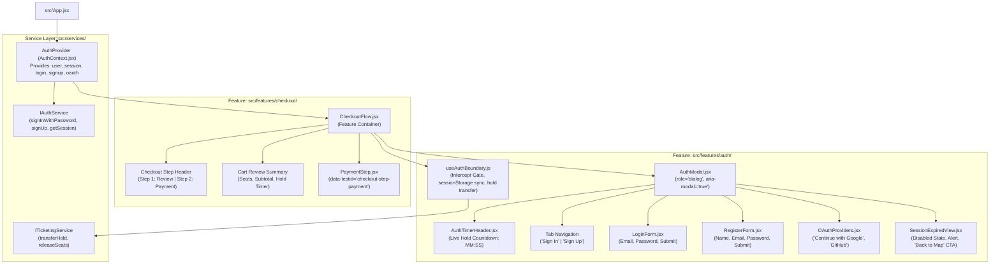
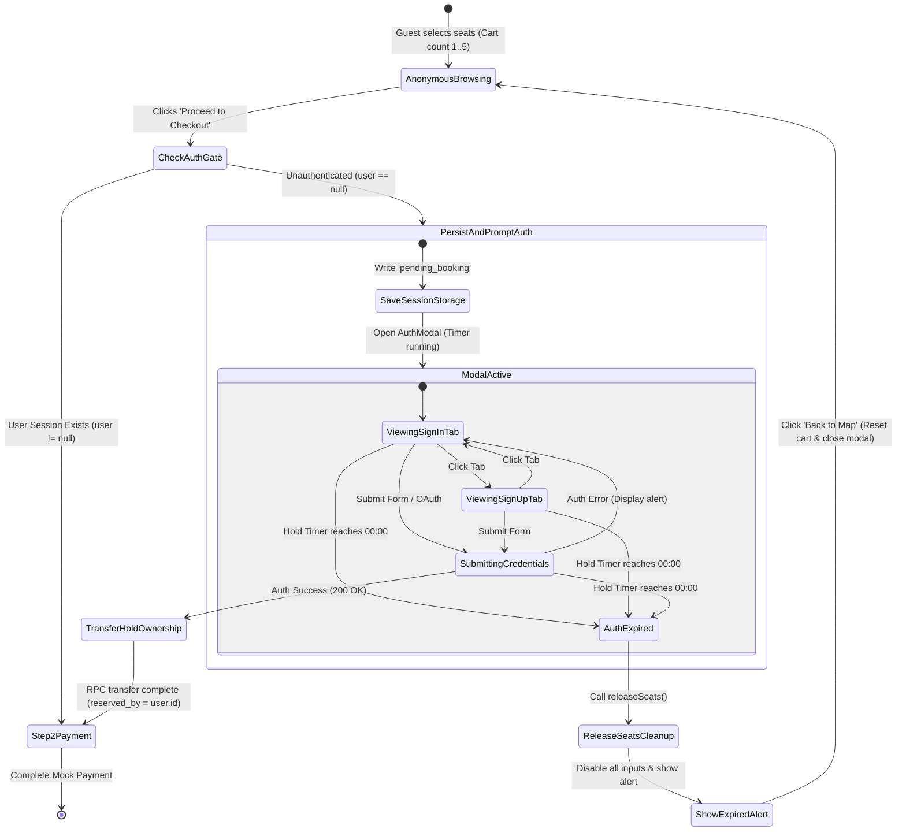

# Implementation Plan: SPEC-03 Smart Frictionless Authentication & Session Retention

**Feature Code:** `FEAT-AUTH-03`  
**Specification Reference:** [`docs/ai-sdlc/specs/SPEC-03-smart-frictionless-auth.md`](file:///f:/SHADI/2-Programming/Interactive%20Event%20Ticketing%20Platform/interactive-event-ticketing-platform/docs/ai-sdlc/specs/SPEC-03-smart-frictionless-auth.md)  
**Parent Intent:** [`intent/interactive-event-ticketing.md`](file:///f:/SHADI/2-Programming/Interactive%20Event%20Ticketing%20Platform/interactive-event-ticketing-platform/intent/interactive-event-ticketing.md)  
**Parent Index:** [`docs/ai-sdlc/specs/README.md`](file:///f:/SHADI/2-Programming/Interactive%20Event%20Ticketing%20Platform/interactive-event-ticketing-platform/docs/ai-sdlc/specs/README.md)  
**Architecture Guidelines:** [`.agents/rules/guidelines.md`](file:///f:/SHADI/2-Programming/Interactive%20Event%20Ticketing%20Platform/interactive-event-ticketing-platform/.agents/rules/guidelines.md), [`.agents/rules/ticketing-domain.md`](file:///f:/SHADI/2-Programming/Interactive%20Event%20Ticketing%20Platform/interactive-event-ticketing-platform/.agents/rules/ticketing-domain.md), [`.agents/skills/scaffold-feature/SKILL.md`](file:///f:/SHADI/2-Programming/Interactive%20Event%20Ticketing%20Platform/interactive-event-ticketing-platform/.agents/skills/scaffold-feature/SKILL.md)  
**Status:** Ready for Implementation  
**Estimated Touchpoints:** 2 existing files modified, 13 new feature/test files created  

---

## 1. Executive Summary & Specification Scope

The objective of this plan is to implement **Smart Frictionless Authentication & Session Retention** (`FEAT-AUTH-03`), satisfying all requirements and acceptance criteria established in [`SPEC-03-smart-frictionless-auth.md`](file:///f:/SHADI/2-Programming/Interactive%20Event%20Ticketing%20Platform/interactive-event-ticketing-platform/docs/ai-sdlc/specs/SPEC-03-smart-frictionless-auth.md).

### 1.1 Core Boundaries & Guarantees
1. **Frictionless Anonymous Browsing (Checkout Boundary Gate):**
   - Unauthenticated visitors can freely browse events, inspect venue maps, select up to 5 seats, and review their cart subtotal without encountering any login barriers or sign-up walls.
   - Authentication is strictly deferred until the visitor clicks **"Proceed to Checkout"**.
   - If the attendee has an active user session (`user !== null`), they transition immediately to Step 2 (Payment).
   - If unauthenticated, the system intercepts navigation, preserves seat hold state in `sessionStorage` (`pending_booking`), and displays an accessible modal (`<AuthModal />`).

2. **Zero-Loss Selection Retention & Ownership Transfer:**
   - Active seat selections and temporary hold locks are preserved seamlessly across authentication transitions (Email/Password or OAuth).
   - Upon successful login or registration, the system invokes an account-linkage protocol transferring the temporary hold ownership to `user.id`.
   - The `<AuthModal />` automatically closes and transitions directly to Step 2 ("Payment") without refreshing the page, resetting the cart, or dropping selected seats.
   - **No Timer Reset / Inflation:** The 300-second countdown timer continues counting down from the original expiration timestamp (`reservedUntil`), preventing seat hoarding or timer manipulation.

3. **In-Flight Hold Expiration Lockdown (Edge Case):**
   - The hold countdown timer remains visible and continuously evaluated inside the `<AuthModal />` header.
   - If the 300-second hold timer reaches `00:00` while the attendee is actively interacting with the auth modal (e.g. typing credentials or awaiting submission):
     - All modal inputs (email, password, submit buttons, OAuth buttons) are immediately disabled.
     - A prominent warning alert displays: *"Your reservation hold has expired. The seats have been released."*
     - The held seats are released back to `available` via `releaseSeats()`.
     - `pending_booking` is evicted from `sessionStorage`.
     - A "Back to Map" CTA dismisses the modal and routes the visitor back to the seating map with a reset cart.

---

## 2. Architecture & Design Blueprint

### 2.1 Component Hierarchy & Data Flow



---

### 2.2 Finite State Machine: Auth Boundary & Session Lifecycle



---

### 2.3 Detailed Protocols & Data Flow

#### Protocol 1: Boundary Gate & Session Storage Persistence
When an anonymous guest clicks **"Proceed to Checkout"**:
1. `useAuthBoundary` executes `getSession()`.
2. If `user` is valid:
   - Sets checkout step to `payment`.
   - Populates attendee info directly from `user.email`.
3. If `user` is `null`:
   - Serializes cart and hold data into `sessionStorage`:
     ```typescript
     interface PendingBookingPayload {
       eventId: string;
       seatIds: string[];
       seats: Array<{ id: string; rowLabel: string; seatNumber: number; category: string; price: number }>;
       reservedUntil: string; // ISO 8601 string, e.g. "2026-10-03T07:35:00.000Z"
       subtotal: number;
       anonymousSessionId: string;
     }
     ```
   - Sets `isAuthModalOpen = true`.
   - Mounts `<AuthModal />` with focus trapped inside the dialog (`role="dialog"`).

#### Protocol 2: Post-Auth Seat Transfer & Seamless Progression
Upon successful authentication (`signIn` or `signUp`):
1. `authService` returns authenticated `user` record (`id`, `email`, `user_metadata`).
2. `useAuthBoundary` catches successful auth:
   - Reads `pending_booking` payload from `sessionStorage` (or memory cache).
   - Dispatches hold ownership transfer:
     ```typescript
     await ticketingService.transferHold({
       eventId: payload.eventId,
       seatIds: payload.seatIds,
       userId: user.id,
       anonymousSessionId: payload.anonymousSessionId
     });
     ```
   - Auto-fills attendee details in payment summary:
     - Name: `user.user_metadata?.full_name || 'Valued Attendee'`
     - Email: `user.email`
   - Closes `<AuthModal />` (`isAuthModalOpen = false`).
   - Sets checkout step to `payment` (`data-testid="checkout-step-payment"`).
   - Preserves exact seat list, tier categories, and subtotal.
   - Retains original `reservedUntil` timestamp (guaranteeing no reset).

#### Protocol 3: Auth Modal Hold Expiration Edge Case
While the user is interacting with `<AuthModal />`:
1. `<AuthTimerHeader />` evaluates remaining time every 1000ms:
   $$\text{remaining} = \max(0, \lfloor(\text{reservedUntil} - \text{Date.now()}) / 1000\rfloor)$$
2. When $\text{remaining} \le 0$:
   - Triggers `onTimerExpired()` callback in `useAuthBoundary`.
   - Transitions modal into expired mode:
     - All form inputs (`<input type="email">`, `<input type="password">`, submit buttons, OAuth buttons) receive `disabled={true}`.
     - Displays accessible alert banner (`role="alert"`):
       > **Your reservation hold has expired. The seats have been released.**
     - Dispatches `ticketingService.releaseSeats(eventId, seatIds, anonymousSessionId)`.
     - Clears `sessionStorage.removeItem('pending_booking')`.
     - Renders "Back to Map" button (`data-testid="back-to-map-btn"`).
3. Attendee clicks "Back to Map":
   - Closes modal.
   - Clears cart selections in parent state.
   - Navigates back to the interactive seat map where seats are now marked `available`.

---

## 3. Storage Schema & Service Contracts

### 3.1 `sessionStorage` Key & Schema Contract

| Storage Key | Type | Description |
| :--- | :--- | :--- |
| `pending_booking` | JSON String | Holds active event ID, selected seat IDs, seat metadata, expiration ISO timestamp, subtotal, and anonymous session UUID. |

```json
{
  "eventId": "00000000-0000-0000-0000-000000000001",
  "seatIds": ["C-1", "C-2"],
  "seats": [
    { "id": "C-1", "rowLabel": "C", "seatNumber": 1, "category": "VIP", "price": 150.00 },
    { "id": "C-2", "rowLabel": "C", "seatNumber": 2, "category": "VIP", "price": 150.00 }
  ],
  "reservedUntil": "2026-10-03T12:05:00.000Z",
  "subtotal": 300.00,
  "anonymousSessionId": "anon_session_8f3a9e"
}
```

### 3.2 Service Contract Extension (`ITicketingService` & `IAuthService`)

```typescript
// In src/services/ticketingService.js
export interface ITicketingService {
  // Existing methods:
  getEventDetails(eventId: string): Promise<EventRecord>;
  getVenueLayout(venueId: string): Promise<VenueLayout>;
  getSeatAvailability(eventId: string): Promise<SeatRecord[]>;
  reserveSeats(eventId: string, seatIds: string[], userId: string, holdDurationSeconds?: number): Promise<ReservationResult>;
  releaseSeats(eventId: string, seatIds: string[], userId: string): Promise<{ releasedSeatIds: string[] }>;
  
  // SPEC-03 Extended method:
  transferHold(
    eventId: string,
    seatIds: string[],
    userId: string,
    anonymousSessionId?: string
  ): Promise<{ success: boolean; transferredSeatIds: string[] }>;
}

// In src/services/authService.js
export interface IAuthService {
  getSession(): Promise<{ user: AuthUser | null }>;
  signInWithPassword(credentials: { email: string; password: string }): Promise<{ user: AuthUser; error: null } | { user: null; error: Error }>;
  signUp(credentials: { email: string; password: string; fullName?: string }): Promise<{ user: AuthUser; error: null } | { user: null; error: Error }>;
  signInWithOAuth(provider: 'google' | 'github'): Promise<{ provider: string }>;
  signOut(): Promise<void>;
  onAuthStateChange(callback: (user: AuthUser | null) => void): () => void;
}
```

---

## 4. Minimal Changes & Scaffolding Breakdown

Adhering strictly to `.agents/skills/scaffold-feature/SKILL.md` and `.agents/rules/guidelines.md`:

```text
src/
├── features/
│   ├── auth/                                # Feature module: FEAT-AUTH-03
│   │   ├── index.js                         # Public exports
│   │   ├── AuthModal.jsx                    # Primary modal container (role="dialog")
│   │   ├── AuthModal.css                    # Accessible modal styling & transitions
│   │   ├── context/
│   │   │   └── AuthContext.jsx              # AuthContext & AuthProvider
│   │   ├── hooks/
│   │   │   ├── useAuth.js                   # Hook to consume AuthContext
│   │   │   └── useAuthBoundary.js           # Intercept gate, storage sync & hold transfer
│   │   └── components/
│   │       ├── AuthTimerHeader.jsx          # Live MM:SS hold countdown display
│   │       ├── LoginForm.jsx                # Email + Password tab form
│   │       ├── RegisterForm.jsx             # New attendee sign-up tab form
│   │       ├── OAuthProviders.jsx           # Google & GitHub OAuth buttons
│   │       └── SessionExpiredView.jsx       # Disabled form alert & "Back to Map" CTA
│   │
│   └── checkout/                            # Checkout boundary coordination
│       ├── index.js                         # Public exports
│       ├── CheckoutFlow.jsx                 # Checkout container with Step 1 & Step 2
│       ├── CheckoutFlow.css                 # Checkout styling
│       └── components/
│           └── PaymentStep.jsx              # Step 2 screen (data-testid="checkout-step-payment")
│
├── services/
│   ├── authService.js                       # Mock/Supabase auth abstraction
│   └── ticketingService.js                  # Ticketing & hold transfer service
│
tests/
├── features/
│   ├── auth-boundary.test.jsx               # Scenarios 3.1 & 3.2 (Prompt, Retention, Link)
│   └── auth-boundary-timeout.test.jsx       # Scenario 3.3 (Expiration during Auth modal)
└── mocks/
    └── mockAuthService.js                   # Mock auth provider fixture for deterministic tests
```

### Summary of Touched Files:
- **Modified (2):**
  - `src/App.jsx` (Mount `AuthProvider` and `CheckoutFlow` entry point)
  - `package.json` (Verify test runner commands and dependencies)
- **New Feature/Test Files (13):**
  - `src/services/authService.js`
  - `src/services/ticketingService.js`
  - `src/features/auth/index.js`
  - `src/features/auth/context/AuthContext.jsx`
  - `src/features/auth/hooks/useAuth.js`
  - `src/features/auth/hooks/useAuthBoundary.js`
  - `src/features/auth/components/AuthTimerHeader.jsx`
  - `src/features/auth/components/LoginForm.jsx`
  - `src/features/auth/components/RegisterForm.jsx`
  - `src/features/auth/components/OAuthProviders.jsx`
  - `src/features/auth/components/SessionExpiredView.jsx`
  - `src/features/auth/AuthModal.jsx`
  - `src/features/auth/AuthModal.css`
  - `src/features/checkout/index.js`
  - `src/features/checkout/CheckoutFlow.jsx`
  - `src/features/checkout/CheckoutFlow.css`
  - `src/features/checkout/components/PaymentStep.jsx`
  - `tests/mocks/mockAuthService.js`
  - `tests/features/auth-boundary.test.jsx`
  - `tests/features/auth-boundary-timeout.test.jsx`

---

## 5. Step-by-Step Implementation Phases

### Phase 1: Test Infrastructure & Auth Service Abstraction
1. **Mock Auth Provider (`tests/mocks/mockAuthService.js`):**
   - Provide deterministic in-memory auth simulation with `signInWithPassword`, `signUp`, `signInWithOAuth`, `signOut`, `getSession`.
   - Configurable initial user state (`null` for guest, `{ id: 'u123', email: 'attendee@example.com' }` for authenticated).
2. **Domain Service Implementation (`src/services/authService.js` & `src/services/ticketingService.js`):**
   - Implement `authService` conforming to `IAuthService`.
   - Implement `ticketingService.transferHold(eventId, seatIds, userId)` which updates seat reservations to `reserved_by = userId`.
   - Implement `ticketingService.releaseSeats(eventId, seatIds, userId)` which reverts seats to `status = 'available'`.

### Phase 2: Auth Context & State Management
1. **Create `src/features/auth/context/AuthContext.jsx`:**
   - State: `user`, `session`, `isLoading`, `authError`.
   - Methods: `signIn`, `signUp`, `signInWithOAuth`, `signOut`.
   - Exposes `AuthContext.Provider`.
2. **Create `src/features/auth/hooks/useAuth.js`:**
   - Standard consumer hook with safeguard throwing error if called outside `AuthProvider`.
3. **Create `src/features/auth/hooks/useAuthBoundary.js`:**
   - Accepts: `{ eventId, selectedSeats, subtotal, reservedUntil, onHoldExpired, onTransferSuccess }`.
   - Exposes:
     - `isAuthModalOpen`: boolean state.
     - `proceedToCheckout()`: checks `user`. If unauthenticated, serializes `pending_booking` to `sessionStorage` and opens modal.
     - `closeAuthModal()`: dismisses modal.
     - `handleAuthSuccess(user)`: invokes `ticketingService.transferHold`, cleans/marks storage, fires `onTransferSuccess()`.
     - `handleHoldExpired()`: clears `sessionStorage`, calls `ticketingService.releaseSeats`, notifies modal of expiry.

### Phase 3: Auth Modal Subcomponents
1. **Create `src/features/auth/components/AuthTimerHeader.jsx`:**
   - Accepts `reservedUntil` timestamp.
   - Computes formatted `MM:SS` string (e.g. `"04:58"`).
   - Updates every 1000ms using `setInterval`.
   - Renders badge with icon and live timer.
   - Calls `onExpire()` when countdown reaches `00:00`.
2. **Create `src/features/auth/components/LoginForm.jsx`:**
   - Inputs: Email (`type="email"`, `name="email"`), Password (`type="password"`, `name="password"`).
   - "Sign In" submit button (`type="submit"`).
   - Supports `disabled` prop when hold has expired.
   - Accessible error summary (`role="alert"`) if submission fails.
3. **Create `src/features/auth/components/RegisterForm.jsx`:**
   - Inputs: Full Name, Email, Password.
   - "Create Account" submit button.
   - Supports `disabled` prop when hold has expired.
4. **Create `src/features/auth/components/OAuthProviders.jsx`:**
   - Buttons: "Continue with Google" (`data-testid="oauth-google-btn"`), "Continue with GitHub".
   - Supports `disabled` prop when hold has expired.
5. **Create `src/features/auth/components/SessionExpiredView.jsx`:**
   - Rendered when hold timer reaches `00:00`.
   - Displays alert banner: *"Your reservation hold has expired. The seats have been released."*
   - Renders "Back to Map" button (`data-testid="back-to-map-btn"`).

### Phase 4: Modal Container & Checkout Flow
1. **Create `src/features/auth/AuthModal.jsx`:**
   - Modal wrapper with `role="dialog"`, `aria-modal="true"`, `aria-labelledby="auth-modal-title"`.
   - Traps keyboard focus inside dialog; dismisses on `Escape` key if not expired.
   - Tab switching between "Sign In" and "Sign Up".
   - Header with title: *"Sign In to Complete Booking"*.
   - Renders `<AuthTimerHeader />` displaying remaining hold time.
   - If expired: disables all inputs and renders `<SessionExpiredView />`.
2. **Create `src/features/checkout/components/PaymentStep.jsx`:**
   - Container with `data-testid="checkout-step-payment"`.
   - Displays Attendee Name and Email (pre-filled from authenticated user).
   - Displays retained seat tags (e.g. `C-1`, `C-2`).
   - Displays subtotal (`data-testid="cart-subtotal"`: `"$300.00"`).
   - Displays running hold timer continuing from original `reservedUntil`.
3. **Create `src/features/checkout/CheckoutFlow.jsx`:**
   - Orchestrates Step 1 (Cart Review) and Step 2 (Payment).
   - "Proceed to Checkout" button connects to `useAuthBoundary.proceedToCheckout()`.
   - Renders `<AuthModal />` when `isAuthModalOpen === true`.
   - Transitions directly to `<PaymentStep />` upon successful auth and hold transfer.
4. **Create `src/features/auth/AuthModal.css` & `src/features/checkout/CheckoutFlow.css`:**
   - High-contrast accessible focus styles, clean modern dialog backdrop, responsive flex/grid layouts.
5. **Update `src/features/auth/index.js` & `src/features/checkout/index.js`:**
   - Export public components and hooks cleanly.

### Phase 5: App Integration & Verification
1. Mount `<AuthProvider>` and `<CheckoutFlow />` in `src/App.jsx`.
2. Execute automated test suites with Vitest.
3. Validate zero ESLint warnings and clean production build.

---

## 6. Verification & Automated Test Matrix

The test suite directly verifies every acceptance criterion in [`SPEC-03`](file:///f:/SHADI/2-Programming/Interactive%20Event%20Ticketing%20Platform/interactive-event-ticketing-platform/docs/ai-sdlc/specs/SPEC-03-smart-frictionless-auth.md) using Vitest and React Testing Library:

| Acceptance Criteria / Scenario | Target Test File | Test Case Description | Key Assertions & Matchers |
| :--- | :--- | :--- | :--- |
| **Scenario 3.1: Frictionless Auth Prompt at Checkout Boundary** | `tests/features/auth-boundary.test.jsx` | Unauthenticated guest selects 2 VIP seats ($300.00) and clicks "Proceed to Checkout" | `expect(screen.getByRole('dialog')).toBeInTheDocument();`<br>`expect(screen.getByText('Sign In to Complete Booking')).toBeInTheDocument();`<br>`expect(screen.getByRole('tab', { name: /Sign In/i })).toBeInTheDocument();`<br>`expect(screen.getByRole('tab', { name: /Sign Up/i })).toBeInTheDocument();`<br>`expect(screen.getByRole('button', { name: /Continue with Google/i })).toBeInTheDocument();` |
| **Scenario 3.1: Active Hold Timer in Modal Header** | `tests/features/auth-boundary.test.jsx` | Verifies countdown timer displays formatted time inside modal header | `expect(screen.getByTestId('auth-modal-timer')).toHaveTextContent(/04:58\|05:00/);` |
| **Scenario 3.1: Storage Persistence on Intercept** | `tests/features/auth-boundary.test.jsx` | Verifies `pending_booking` payload is written to `sessionStorage` before modal opens | `const stored = JSON.parse(sessionStorage.getItem('pending_booking'));`<br>`expect(stored.seatIds).toEqual(['C-1', 'C-2']);`<br>`expect(stored.subtotal).toBe(300.00);` |
| **Scenario 3.2: Account Linkage Post-Auth** | `tests/features/auth-boundary.test.jsx` | Signs in with `attendee@example.com` while modal is open with seats "C-1", "C-2" held | `expect(transferHoldSpy).toHaveBeenCalledWith(expect.objectContaining({ seatIds: ['C-1', 'C-2'], userId: 'user-123' }));` |
| **Scenario 3.2: Modal Closes & Advances to Payment Step** | `tests/features/auth-boundary.test.jsx` | Asserts modal automatically closes and attendee lands on Step 2 ("Payment") | `await waitFor(() => expect(screen.queryByRole('dialog')).not.toBeInTheDocument());`<br>`expect(screen.getByTestId('checkout-step-payment')).toBeInTheDocument();` |
| **Scenario 3.2: Selection Retention & No Timer Reset** | `tests/features/auth-boundary.test.jsx` | Confirms seats "C-1", "C-2", subtotal "$300.00", and original countdown timestamp are preserved | `expect(screen.getByTestId('cart-subtotal')).toHaveTextContent('$300.00');`<br>`expect(screen.getByText('C-1')).toBeInTheDocument();`<br>`expect(screen.getByText('C-2')).toBeInTheDocument();`<br>`// Timer continues from original reservedUntil timestamp (no reset to 300s)` |
| **Scenario 3.3: Hold Timer Expiration During Auth Modal** | `tests/features/auth-boundary-timeout.test.jsx` | Advances fake timers by 300s while attendee is on the auth modal | `vi.advanceTimersByTime(300000);`<br>`expect(screen.getByText(/Your reservation hold has expired/i)).toBeInTheDocument();` |
| **Scenario 3.3: Form Inputs Disabled on Timeout** | `tests/features/auth-boundary-timeout.test.jsx` | Asserts email, password, submit, and OAuth buttons are disabled | `expect(screen.getByLabelText(/Email/i)).toBeDisabled();`<br>`expect(screen.getByLabelText(/Password/i)).toBeDisabled();`<br>`expect(screen.getByRole('button', { name: /Sign In/i })).toBeDisabled();`<br>`expect(screen.getByTestId('oauth-google-btn')).toBeDisabled();` |
| **Scenario 3.3: Release Held Seats on Expiration** | `tests/features/auth-boundary-timeout.test.jsx` | Verifies `releaseSeats()` is invoked with held seat IDs | `expect(releaseSeatsSpy).toHaveBeenCalledWith(expect.objectContaining({ seatIds: ['D-4', 'D-5'] }));`<br>`expect(sessionStorage.getItem('pending_booking')).toBeNull();` |
| **Scenario 3.3: "Back to Map" CTA Navigation** | `tests/features/auth-boundary-timeout.test.jsx` | Clicks "Back to Map" button; asserts modal dismisses and cart is cleared | `fireEvent.click(screen.getByTestId('back-to-map-btn'));`<br>`expect(screen.queryByRole('dialog')).not.toBeInTheDocument();`<br>`expect(screen.getByTestId('cart-seat-count')).toHaveTextContent('0');` |
| **A11y: Dialog Accessibility & Focus Trap** | `tests/features/auth-boundary.test.jsx` | Validates `aria-modal="true"`, `aria-labelledby`, and Escape key dismissal when active | `expect(screen.getByRole('dialog')).toHaveAttribute('aria-modal', 'true');` |

---

## 7. Rollback & Recovery Plan

In the event of implementation errors, test regressions, or spec changes:

### Step 1: Revert Code Modifications
```bash
# Revert modified root files
git checkout HEAD -- src/App.jsx package.json package-lock.json
```

### Step 2: Remove Newly Scaffolding Feature & Test Files
```bash
# Remove auth and checkout feature directories
rm -rf src/features/auth src/features/checkout
rm -rf src/services/authService.js src/services/ticketingService.js
rm -rf tests/features/auth-boundary.test.jsx tests/features/auth-boundary-timeout.test.jsx tests/mocks/mockAuthService.js
```

### Step 3: Reinstall & Validate Baseline
```bash
# Clean install dependencies
npm install

# Verify workspace is lint and build clean
npm run lint
npm run build
```

---

## 8. Implementation Checklist & Sign-Off Criteria

- [ ] **Boundary Trigger:** Frictionless browsing verified; unauthenticated users only prompted upon clicking "Proceed to Checkout".
- [ ] **Storage Serialization:** `sessionStorage.getItem('pending_booking')` contains `eventId`, `seatIds`, `reservedUntil`, and `subtotal`.
- [ ] **Zero Seat Loss:** Seat IDs, tier breakdown, and subtotal preserved post-login.
- [ ] **Hold Ownership Transfer:** Seat reservation linked to authenticated user account.
- [ ] **No Timer Inflation:** Timer does not reset upon sign-in; counts down continuously from initial expiration timestamp.
- [ ] **Timeout Lockdown:** All auth inputs disabled immediately when countdown reaches `00:00`.
- [ ] **Seat Release Handshake:** `releaseSeats()` triggered and storage cleared on expiration.
- [ ] **Accessible Dialog:** Modal adheres to WCAG 2.1 AA dialog patterns with focus management and ARIA roles.
- [ ] **Automated Tests:** 100% test pass rate across `auth-boundary.test.jsx` and `auth-boundary-timeout.test.jsx`.
- [ ] **Lint & Build:** `npm run lint` and `npm run build` pass with 0 warnings/errors.
