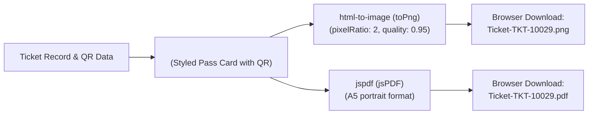
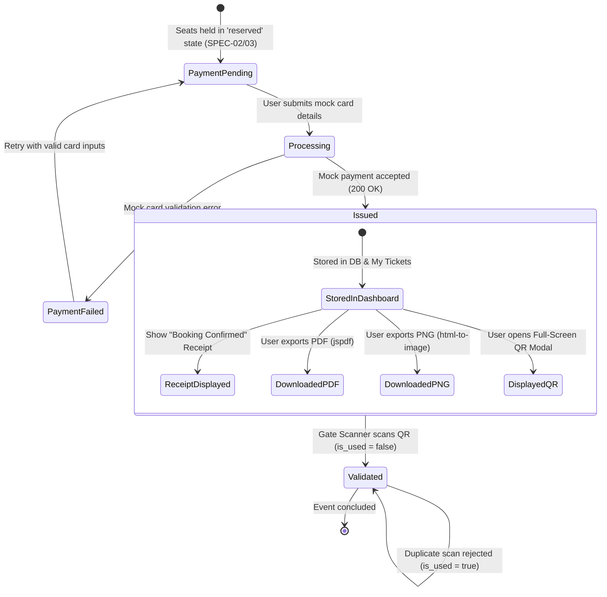
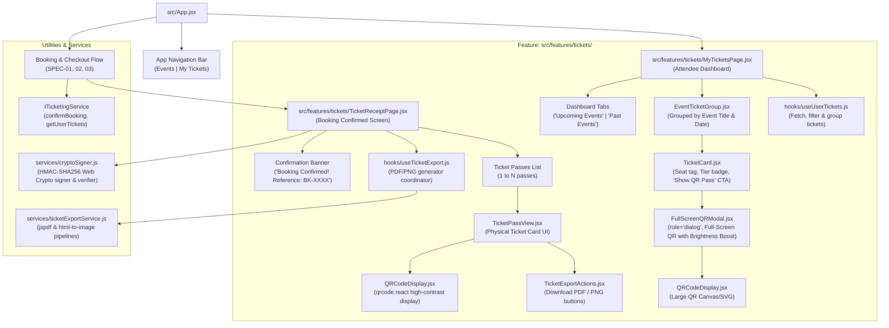

# Implementation Plan: SPEC-04 Digital Ticket Issuance, Signed QR Codes & Export

**Feature Code:** `FEAT-TICK-04`  
**Specification Reference:** [`docs/ai-sdlc/specs/SPEC-04-digital-tickets-and-qr.md`](file:///f:/SHADI/2-Programming/Interactive%20Event%20Ticketing%20Platform/interactive-event-ticketing-platform/docs/ai-sdlc/specs/SPEC-04-digital-tickets-and-qr.md)  
**Parent Intent:** [`intent/interactive-event-ticketing.md`](file:///f:/SHADI/2-Programming/Interactive%20Event%20Ticketing%20Platform/interactive-event-ticketing-platform/intent/interactive-event-ticketing.md)  
**Parent Index:** [`docs/ai-sdlc/specs/README.md`](file:///f:/SHADI/2-Programming/Interactive%20Event%20Ticketing%20Platform/interactive-event-ticketing-platform/docs/ai-sdlc/specs/README.md)  
**Architecture Guidelines:** [`.agents/rules/guidelines.md`](file:///f:/SHADI/2-Programming/Interactive%20Event%20Ticketing%20Platform/interactive-event-ticketing-platform/.agents/rules/guidelines.md), [`.agents/rules/ticketing-domain.md`](file:///f:/SHADI/2-Programming/Interactive%20Event%20Ticketing%20Platform/interactive-event-ticketing-platform/.agents/rules/ticketing-domain.md), [`.agents/skills/scaffold-feature/SKILL.md`](file:///f:/SHADI/2-Programming/Interactive%20Event%20Ticketing%20Platform/interactive-event-ticketing-platform/.agents/skills/scaffold-feature/SKILL.md)  
**Status:** Ready for Implementation  
**Estimated Touchpoints:** 3 existing files modified, 15 new feature files, 1 SQL migration, 4 test suites created  

---

## 1. Executive Summary & Specification Scope

The objective of this plan is to implement the **Digital Ticket Issuance, Cryptographically Signed QR Codes, Client-Side Export Pipeline, and "My Tickets" Dashboard** (`FEAT-TICK-04`) adhering to all functional requirements and acceptance criteria established in [`SPEC-04-digital-tickets-and-qr.md`](file:///f:/SHADI/2-Programming/Interactive%20Event%20Ticketing%20Platform/interactive-event-ticketing-platform/docs/ai-sdlc/specs/SPEC-04-digital-tickets-and-qr.md).

### 1.1 Intent Traceability & Core Requirements

| Requirement ID | Intent Line Reference | Description & Testable Boundary |
| :--- | :--- | :--- |
| `REQ-TICK-04.1` | [L17](file:///f:/SHADI/2-Programming/Interactive%20Event%20Ticketing%20Platform/interactive-event-ticketing-platform/intent/interactive-event-ticketing.md#L17), [L85-L88](file:///f:/SHADI/2-Programming/Interactive%20Event%20Ticketing%20Platform/interactive-event-ticketing-platform/intent/interactive-event-ticketing.md#L85-L88), [L152](file:///f:/SHADI/2-Programming/Interactive%20Event%20Ticketing%20Platform/interactive-event-ticketing-platform/intent/interactive-event-ticketing.md#L152), [L163](file:///f:/SHADI/2-Programming/Interactive%20Event%20Ticketing%20Platform/interactive-event-ticketing-platform/intent/interactive-event-ticketing.md#L163) | **Mock Checkout Completion & Permanent Sold State:** Submitting valid payment details transitions held seats permanently to `sold` (`#9CA3AF`, Gray-400), updates booking status to `confirmed`, creates unique ticket records, and redirects to the confirmation receipt page. |
| `REQ-TICK-04.2` | [L12](file:///f:/SHADI/2-Programming/Interactive%20Event%20Ticketing%20Platform/interactive-event-ticketing-platform/intent/interactive-event-ticketing.md#L12), [L89](file:///f:/SHADI/2-Programming/Interactive%20Event%20Ticketing%20Platform/interactive-event-ticketing-platform/intent/interactive-event-ticketing.md#L89), [L105](file:///f:/SHADI/2-Programming/Interactive%20Event%20Ticketing%20Platform/interactive-event-ticketing-platform/intent/interactive-event-ticketing.md#L105), [L153](file:///f:/SHADI/2-Programming/Interactive%20Event%20Ticketing%20Platform/interactive-event-ticketing-platform/intent/interactive-event-ticketing.md#L153) | **Cryptographically Signed QR Code:** Generates high-contrast QR code (`qrcode.react`) embedding an HMAC-SHA256 signature payload (`{ tid, bid, eid, sid, tier, iat, sig }`). Verifiable tamper-proof structure with isolated mock signing and strict production Edge Function demarcation. |
| `REQ-TICK-04.3` | [L19](file:///f:/SHADI/2-Programming/Interactive%20Event%20Ticketing%20Platform/interactive-event-ticketing-platform/intent/interactive-event-ticketing.md#L19), [L153](file:///f:/SHADI/2-Programming/Interactive%20Event%20Ticketing%20Platform/interactive-event-ticketing-platform/intent/interactive-event-ticketing.md#L153) | **Gate Validator Readiness:** Database schema stores `is_used` (boolean) and `scanned_at` (timestamp) fields. Provides idempotent gate scanning logic rejecting duplicate entries with clear timestamped feedback. |
| `REQ-TICK-04.4` | [L12](file:///f:/SHADI/2-Programming/Interactive%20Event%20Ticketing%20Platform/interactive-event-ticketing-platform/intent/interactive-event-ticketing.md#L12), [L90](file:///f:/SHADI/2-Programming/Interactive%20Event%20Ticketing%20Platform/interactive-event-ticketing-platform/intent/interactive-event-ticketing.md#L90), [L106-L107](file:///f:/SHADI/2-Programming/Interactive%20Event%20Ticketing%20Platform/interactive-event-ticketing-platform/intent/interactive-event-ticketing.md#L106-L107), [L164](file:///f:/SHADI/2-Programming/Interactive%20Event%20Ticketing%20Platform/interactive-event-ticketing-platform/intent/interactive-event-ticketing.md#L164) | **Client-Side Document Export:** Instant browser download of printable PDF (`jspdf`) and high-resolution 2x PNG (`html-to-image`) without third-party email dependencies or server roundtrips. |
| `REQ-TICK-04.5` | [L17](file:///f:/SHADI/2-Programming/Interactive%20Event%20Ticketing%20Platform/interactive-event-ticketing-platform/intent/interactive-event-ticketing.md#L17), [L91](file:///f:/SHADI/2-Programming/Interactive%20Event%20Ticketing%20Platform/interactive-event-ticketing-platform/intent/interactive-event-ticketing.md#L91), [L162](file:///f:/SHADI/2-Programming/Interactive%20Event%20Ticketing%20Platform/interactive-event-ticketing-platform/intent/interactive-event-ticketing.md#L162) | **"My Tickets" Dashboard:** Responsive dashboard listing the authenticated attendee's confirmed tickets grouped by event, launching a full-screen QR modal with brightness boost, and supporting pass re-downloads. |

---

## 2. Technical Architecture & Cryptographic Design

### 2.1 Cryptographic QR Code Payload & HMAC-SHA256 Signing

To prevent ticket forgery, scalping alteration, and offline replay attacks, every digital ticket embeds a cryptographically signed payload within its visual QR code:

```json
{
  "tid": "tkt_98765432-abcd",
  "bid": "bk_12345678-efgh",
  "eid": "00000000-0000-0000-0000-000000000001",
  "sid": "seat_A12",
  "tier": "VIP",
  "iat": 1790998800,
  "sig": "e3b0c44298fc1c149afbf4c8996fb92427ae41e4649b934ca495991b7852b855"
}
```

#### Canonical Serialization & Signing Protocol
1. **Canonical Payload String:**
   To guarantee deterministic hashing across languages and runtimes, fields are serialized into a normalized pipe-delimited canonical string prior to signing:
   $$\text{canonicalMessage} = \text{tid} \parallel ":" \parallel \text{bid} \parallel ":" \parallel \text{eid} \parallel ":" \parallel \text{sid} \parallel ":" \parallel \text{tier} \parallel ":" \parallel \text{iat}$$
2. **Digest Computation:**
   $$\text{sig} = \text{HMAC-SHA256}(\text{canonicalMessage}, K_{\text{HMAC}})$$
   Encoded as a 64-character lowercase hexadecimal string.
3. **Environment Demarcation:**
   - **Frontend MVP / Mock Mode (`cryptoSigner.js`):**
     Utilizes standard Web Crypto API (`window.crypto.subtle` / `globalThis.crypto.subtle`) via `SubtleCrypto.importKey` and `SubtleCrypto.sign('HMAC')`. A deterministic mock secret (`VITE_MOCK_HMAC_SECRET` or fallback `"mock-ticketing-secret-key-2026"`) is used for signing in mock mode and unit tests.
   - **Production Architecture (Supabase Edge Function):**
     In live production, tickets are signed server-side inside the `confirm_booking` Edge Function before returning to the client. The private signing secret `TICKET_HMAC_SECRET` is stored strictly in Supabase Vault and is never exposed to the client bundle. Gate validator devices invoke `validate_ticket_scan` RPC or an offline verification service possessing the corresponding verification key.

### 2.2 Gate Validator Readiness & Idempotency Protocol

To prepare for future physical gate scanners and enforce one-time admission:
1. Every ticket record in PostgreSQL / Mock Store includes:
   - `is_used`: `BOOLEAN NOT NULL DEFAULT FALSE`
   - `scanned_at`: `TIMESTAMPTZ DEFAULT NULL`
2. **Idempotent Scan State Transitions:**
   - **First Scan:** If `is_used === false`:
     - Updates `is_used = true` and `scanned_at = NOW()`.
     - Returns `{ valid: true, status: 'ENTRY_GRANTED', scanned_at: NOW() }`.
   - **Subsequent Scan (Duplicate Entry Attempt):** If `is_used === true`:
     - Rejects admission: `{ valid: false, status: 'ALREADY_USED', message: 'Ticket already scanned at 2026-10-05T14:22:10Z' }`.
   - **Tampered QR Payload:** If payload signature `sig` does not match HMAC of fields:
     - Rejects admission: `{ valid: false, status: 'INVALID_SIGNATURE', message: 'Cryptographic signature mismatch.' }`.

### 2.3 Client-Side Document Export Pipeline

The export pipeline generates production-quality physical and raster passes instantly in the browser without server roundtrips:



1. **Pass Layout Container (`TicketPassView.jsx`):**
   - Styled high-contrast event pass card featuring:
     - Event Banner & Title (`Grand Symphony Night 2026`)
     - Date & Time (`Saturday, Oct 15, 2026 • 8:00 PM`)
     - Venue & Location (`Grand Symphony Hall, San Francisco`)
     - Section, Row, and Seat Designation (`Orchestra VIP • Row A • Seat 12`)
     - Tier Badge (`VIP`)
     - Attendee Full Name & Unique Ticket Code (`TKT-10029`)
     - High-contrast QR Code (`qrcode.react`) with quiet zone margin
2. **PNG Export (`useTicketExport.js`):**
   - Calls `toPng(passRef.current, { pixelRatio: 2, quality: 0.95 })`.
   - Generates a 2x retina-crisp raster image and triggers immediate browser anchor download: `Ticket-${ticket.ticket_code}.png`.
3. **PDF Export (`ticketExportService.js`):**
   - Instantiates `new jsPDF({ orientation: 'portrait', unit: 'mm', format: 'a5' })`.
   - Renders event headers, typography, divider lines, and embeds the high-resolution QR image data URL via `doc.addImage()`.
   - Saves file as `Ticket-${ticket.ticket_code}.pdf`.

---

## 3. Finite State Machine: Ticket Lifecycle



### State Transition Matrix

| Current State | Trigger / Event | Condition / Guard | Target State | Actions & Side Effects |
| :--- | :--- | :--- | :--- | :--- |
| `PaymentPending` | `SUBMIT_PAYMENT` | Card number, expiry, CVC valid | `Processing` | Disable inputs; invoke `confirmBooking()` RPC. |
| `Processing` | `RPC_SUCCESS` | Seats held by user | `Issued` | Mark seats `sold` (`#9CA3AF`); compute HMAC signature; generate ticket records; clear hold timer. |
| `Processing` | `RPC_FAILURE` | Hold expired during form submit | `PaymentFailed` | Re-enable inputs; show expiration error; return seats to map. |
| `Issued` | `EXPORT_PDF` | Ticket record exists | `Issued` | Render pass DOM to PDF via `jsPDF`; trigger `Ticket-{code}.pdf` download. |
| `Issued` | `EXPORT_PNG` | Ticket record exists | `Issued` | Render pass DOM to 2x canvas via `html-to-image`; trigger `Ticket-{code}.png` download. |
| `Issued` | `OPEN_QR_MODAL` | Ticket clicked | `Issued` | Display `<FullScreenQRModal />` with brightness boost filter. |
| `Issued` | `GATE_SCAN` | `is_used == false` | `Validated` | Set `is_used = true`, `scanned_at = NOW()`; grant entry. |
| `Validated` | `GATE_SCAN` | `is_used == true` | `Validated` | Reject entry: *"Ticket already scanned at [scanned_at]"*. |

---

## 4. Component Hierarchy & Architecture

Following `.agents/skills/scaffold-feature/SKILL.md`, all ticket issuance, QR presentation, export, and dashboard components are scaffolded under `src/features/tickets/`:



---

## 5. Minimal Changes & Scaffolding Breakdown

Adhering strictly to the principle of **minimal changes** and **reusing existing resources before adding packages**:

### 5.1 Package Dependencies

We add only the 3 specific runtime packages designated in `SPEC-04`:
1. `qrcode.react` (`^4.2.0`): React component for SVG/Canvas QR rendering with error correction.
2. `jspdf` (`^2.5.2`): Lightweight client-side PDF document generation.
3. `html-to-image` (`^1.11.11`): High-fidelity DOM node rasterization to PNG with retina 2x pixel ratio.

> [!NOTE]
> Cryptographic HMAC-SHA256 signature generation and validation relies **strictly on the native Web Crypto API** (`crypto.subtle`), requiring **zero** third-party crypto packages (`crypto-js`, `jsonwebtoken`, etc.).

```bash
npm install qrcode.react jspdf html-to-image
```

### 5.2 Files to Create & Modify

| File Path | Action | Description |
| :--- | :--- | :--- |
| `package.json` | Modify | Add `qrcode.react`, `jspdf`, and `html-to-image` to `dependencies`. |
| `supabase/migrations/20261005_04_tickets_and_qr.sql` | Create | Database schema: `tickets` table, indexes, RLS policies, and stored procedure `confirm_booking` transitioning seats to `sold`. |
| `src/features/tickets/index.js` | Create | Feature public exports (`MyTicketsPage`, `TicketReceiptPage`, `TicketPassView`, `FullScreenQRModal`, hooks). |
| `src/features/tickets/Tickets.css` | Create | Component styles: ticket pass card layout, perforated borders, tier badges, full-screen QR modal, brightness boost filter. |
| `src/features/tickets/TicketReceiptPage.jsx` | Create | Booking confirmed screen displaying reference number, purchase summary, and passes with export actions. |
| `src/features/tickets/MyTicketsPage.jsx` | Create | "My Tickets" dashboard screen grouping confirmed tickets by event, with quick export and full-screen QR triggers. |
| `src/features/tickets/components/TicketPassView.jsx` | Create | Visual ticket pass layout container (Event banner, Date, Venue, Seat, Attendee Name, signed QR). |
| `src/features/tickets/components/QRCodeDisplay.jsx` | Create | High-contrast QR code component using `qrcode.react` with quiet zone and black-on-white styling. |
| `src/features/tickets/components/FullScreenQRModal.jsx` | Create | Full-screen modal (`role="dialog"`) with maximum contrast and brightness boost for effortless gate scanner readability. |
| `src/features/tickets/components/TicketCard.jsx` | Create | Dashboard ticket card showing seat tag, tier badge, and "Show QR Pass" CTA. |
| `src/features/tickets/components/EventTicketGroup.jsx` | Create | Event card grouping multiple seats/passes purchased for the same event. |
| `src/features/tickets/components/TicketExportActions.jsx` | Create | "Download PDF" and "Download PNG" button controls with loading spinners during rasterization. |
| `src/features/tickets/hooks/useTicketExport.js` | Create | Custom hook orchestrating client-side PDF and PNG generation without blocking the UI. |
| `src/features/tickets/hooks/useUserTickets.js` | Create | Custom hook querying user's tickets via `ITicketingService` and grouping them by event. |
| `src/features/tickets/services/cryptoSigner.js` | Create | HMAC-SHA256 signing and verification utility powered by native `crypto.subtle`. |
| `src/features/tickets/services/ticketExportService.js` | Create | Export service executing `jspdf` document building and `html-to-image` raster downloads. |
| `src/features/tickets/utils/ticketCodeGenerator.js` | Create | Helper utility generating readable ticket codes (e.g., `TKT-10029`, `BK-847291`). |
| `src/features/tickets/utils/qrPayload.js` | Create | Canonical payload formatting and serialization utilities. |
| `src/features/seatmap/services/mockTicketingService.js` | Modify | Implement `confirmBooking`, `getUserTickets`, and `validateTicketScan` fulfilling `ITicketingService`. |
| `src/features/checkout/components/PaymentStep.jsx` | Modify | Connect "Confirm & Pay" submission to `confirmBooking()` and redirect to `TicketReceiptPage`. |
| `src/App.jsx` | Modify | Add top navigation link for "My Tickets" and route between booking, checkout, receipt, and dashboard. |
| `tests/unit/qr-signer.test.js` | Create | Unit test suite for Web Crypto HMAC-SHA256 signing, formatting, and tamper detection. |
| `tests/features/ticket-issuance.test.jsx` | Create | Test suite verifying mock payment completion, seat status update to `sold` (`#9CA3AF`), and receipt generation. |
| `tests/features/ticket-export.test.jsx` | Create | Test suite verifying client-side PDF and PNG export invocations and download triggers. |
| `tests/features/my-tickets.test.jsx` | Create | Test suite verifying dashboard ticket grouping, full-screen QR modal with brightness boost, and gate scan idempotency. |

---

## 6. Step-by-Step Implementation Phases

### Phase 1: Database Migration & Domain Service Contracts

1. **Create SQL Migration (`supabase/migrations/20261005_04_tickets_and_qr.sql`):**
   ```sql
   -- Create tickets table
   CREATE TABLE IF NOT EXISTS tickets (
     id UUID PRIMARY KEY DEFAULT uuid_generate_v4(),
     booking_id UUID NOT NULL REFERENCES bookings(id) ON DELETE CASCADE,
     seat_id UUID NOT NULL REFERENCES seats(id) ON DELETE RESTRICT,
     user_id UUID NOT NULL REFERENCES auth.users(id) ON DELETE CASCADE,
     ticket_code TEXT NOT NULL UNIQUE,
     qr_signature TEXT NOT NULL,
     is_used BOOLEAN NOT NULL DEFAULT FALSE,
     scanned_at TIMESTAMPTZ,
     created_at TIMESTAMPTZ NOT NULL DEFAULT NOW()
   );

   CREATE INDEX IF NOT EXISTS idx_tickets_user_id ON tickets(user_id);
   CREATE INDEX IF NOT EXISTS idx_tickets_ticket_code ON tickets(ticket_code);

   -- Stored Procedure: confirm_booking
   CREATE OR REPLACE FUNCTION confirm_booking(
     p_booking_id UUID,
     p_payment_payload JSONB
   ) RETURNS JSONB
   LANGUAGE plpgsql
   SECURITY DEFINER
   AS $$
   DECLARE
     v_booking RECORD;
   BEGIN
     SELECT * INTO v_booking FROM bookings WHERE id = p_booking_id;
     IF NOT FOUND THEN
       RETURN jsonb_build_object('success', false, 'error', 'BOOKING_NOT_FOUND');
     END IF;

     -- Update booking status to confirmed
     UPDATE bookings SET status = 'confirmed', updated_at = NOW() WHERE id = p_booking_id;

     -- Permanently mark reserved seats as sold
     UPDATE seats
     SET status = 'sold', reserved_until = NULL, updated_at = NOW()
     WHERE id IN (SELECT seat_id FROM tickets WHERE booking_id = p_booking_id);

     RETURN jsonb_build_object('success', true, 'status', 'confirmed');
   END;
   $$;
   ```

2. **Extend `mockTicketingService.js`:**
   - Implement `confirmBooking(bookingId, paymentDetails)`:
     - Finds booking and associated seats.
     - Sets seats `status = 'sold'`.
     - Updates booking `status = 'confirmed'`.
     - Generates unique ticket records for each seat with signed QR payloads.
     - Broadcasts seat update events to Realtime subscribers.
     - Returns `{ success: true, status: 'confirmed', bookingId, tickets, seats }`.
   - Implement `getUserTickets(userId)`:
     - Returns all ticket records where `ticket.user_id === userId`, joined with event and seat details.
   - Implement `validateTicketScan(ticketCode, signature)`:
     - Validates cryptographic signature.
     - Checks `is_used`. If false: sets `is_used = true`, `scanned_at = new Date().toISOString()`, returns `{ valid: true, status: 'ENTRY_GRANTED' }`.
     - If true: returns `{ valid: false, status: 'ALREADY_USED', message: `Ticket already scanned at ${ticket.scanned_at}` }`.

### Phase 2: Web Crypto Signing & Payload Utilities

1. **Create `src/features/tickets/utils/qrPayload.js`:**
   - `buildCanonicalString(payload)`: Formats `${tid}:${bid}:${eid}:${sid}:${tier}:${iat}`.
   - `serializeQRPayload(ticket, signature)`: Builds standard QR JSON string containing `{ tid, bid, eid, sid, tier, iat, sig }`.
2. **Create `src/features/tickets/services/cryptoSigner.js`:**
   - Uses `globalThis.crypto.subtle`.
   - `signTicketPayload(data, secretKeyString)`:
     - Imports HMAC-SHA256 key via `crypto.subtle.importKey('raw', encoder.encode(secretKeyString), { name: 'HMAC', hash: 'SHA-256' }, false, ['sign'])`.
     - Computes signature over canonical string via `crypto.subtle.sign('HMAC', key, dataBuffer)`.
     - Returns 64-char hex string: `Array.from(new Uint8Array(sigBuffer)).map(b => b.toString(16).padStart(2, '0')).join('')`.
   - `verifyTicketPayload(payloadWithSig, secretKeyString)`:
     - Extracts canonical string and signature.
     - Computes expected HMAC or invokes `crypto.subtle.verify`.
     - Returns boolean `true` if valid, `false` if tampered.
3. **Create `src/features/tickets/utils/ticketCodeGenerator.js`:**
   - `generateTicketCode()`: Generates human-readable ticket code e.g. `TKT-10029`.
   - `generateBookingId()`: Generates booking identifier e.g. `BK-847291`.

### Phase 3: Client-Side Export Services (PDF & PNG)

1. **Create `src/features/tickets/services/ticketExportService.js`:**
   - `exportTicketAsPng(passElement, ticketCode)`:
     - Imports `toPng` from `html-to-image`.
     - Executes `toPng(passElement, { pixelRatio: 2, quality: 0.95, cacheBust: true })`.
     - Creates synthetic anchor `<a download="Ticket-${ticketCode}.png" href={dataUrl}>` and invokes `click()`.
   - `exportTicketAsPdf(ticket, qrDataUrl)`:
     - Imports `jsPDF` from `jspdf`.
     - Initializes `const doc = new jsPDF({ orientation: 'portrait', unit: 'mm', format: 'a5' })`.
     - Renders header, event banner, typography, divider lines, and seat info.
     - Embeds QR graphic using `doc.addImage(qrDataUrl, 'PNG', x, y, width, height)`.
     - Triggers browser download via `doc.save('Ticket-' + ticket.ticket_code + '.pdf')`.
2. **Create `src/features/tickets/hooks/useTicketExport.js`:**
   - Manages export loading state (`isExportingPdf`, `isExportingPng`, `error`).
   - Exposes `downloadPdf(ticket, qrDataUrl)` and `downloadPng(passRef, ticketCode)`.

### Phase 4: UI Components & Visual Ticket Layout

1. **Create `src/features/tickets/components/QRCodeDisplay.jsx`:**
   - Wraps `QRCodeSVG` / `QRCodeCanvas` from `qrcode.react`.
   - Props: `value` (JSON string), `size` (default 180), `level` (`'H'` - High error correction), `includeMargin` (`true`).
   - Explicit styling: pure white background (`#FFFFFF`), pure black modules (`#000000`).
   - Renders with `data-testid="qr-code-svg"` and `aria-label="Ticket Entry QR Code"`.
2. **Create `src/features/tickets/components/TicketPassView.jsx`:**
   - Styled physical ticket design:
     - Top: Event title, category badge, and banner image.
     - Mid: Date & time, venue name, section, row, seat number, tier badge (`VIP`, `Regular`, `Balcony`), and attendee name.
     - Perforated tear-line separator (CSS dashed border with semi-circle cutouts).
     - Bottom: Prominently displayed `<QRCodeDisplay />`, unique ticket code (`ticket.ticket_code`), and issued timestamp.
   - Attaches `ref` for `html-to-image` raster capture.
3. **Create `src/features/tickets/components/TicketExportActions.jsx`:**
   - "Download PDF" button (`data-testid="download-pdf-btn"`).
   - "Download PNG" button (`data-testid="download-png-btn"`).
   - Shows loading spinners during export rendering.
4. **Create `src/features/tickets/components/FullScreenQRModal.jsx`:**
   - Modal container with `role="dialog"`, `aria-modal="true"`, `aria-labelledby="qr-modal-title"`.
   - High-luminance backdrop with **Brightness Boost** CSS class (`filter: brightness(1.25); background: #ffffff;`).
   - Renders enlarged `<QRCodeDisplay size={300} />` for effortless scanning by gate attendants.
   - Shows seat designation e.g. `Seat A-12 (VIP)` and attendee name.
   - Accessible Close / Dismiss button with Escape key listener.
5. **Create `src/features/tickets/components/TicketCard.jsx` & `EventTicketGroup.jsx`:**
   - Displays compact ticket pass card in "My Tickets" list.
   - Shows seat badge, price, tier color, and ticket code.
   - Action buttons: "Show QR Pass" (`data-testid="show-qr-pass-btn"`), "PDF", "PNG".
   - `EventTicketGroup` organizes tickets by event date and title.
6. **Create `src/features/tickets/Tickets.css`:**
   - Responsive CSS with ticket styling, card cutouts, high-contrast badges, brightness boost animations, and print media queries.

### Phase 5: Container Pages & App Integration

1. **Create `src/features/tickets/TicketReceiptPage.jsx`:**
   - Rendered immediately following successful checkout.
   - Displays:
     - Header: *"Booking Confirmed! Thank you for your purchase."*
     - Booking Reference: `BK-847291`.
     - Total Amount Paid: `$300.00`.
     - Itemized list of `<TicketPassView />` cards with `<TicketExportActions />`.
     - CTA button: "Go to My Tickets" navigating to `/my-tickets`.
2. **Create `src/features/tickets/MyTicketsPage.jsx`:**
   - Uses `useUserTickets()` hook.
   - Displays tab filters: "Upcoming Events" and "Past Events".
   - Renders `<EventTicketGroup />` items for confirmed bookings.
   - Manages active ticket for `<FullScreenQRModal />`.
   - Empty state: *"You have no tickets yet. Explore upcoming events to book seats."*
3. **Update `src/features/checkout/components/PaymentStep.jsx`:**
   - On clicking "Confirm & Pay":
     - Calls `mockTicketingService.confirmBooking(bookingId, paymentData)`.
     - On success: clears hold timer, routes view to `<TicketReceiptPage booking={result} />`.
4. **Update `src/App.jsx`:**
   - Mounts top navigation bar with "Events" and "My Tickets" tabs.
   - Handles route switching between Seat Map, Checkout, Receipt, and My Tickets.
5. **Create `src/features/tickets/index.js`:**
   - Publicly exports all ticket components and services.

---

## 7. Verification & Automated Test Matrix

The test suite directly validates every formal acceptance criterion and scenario from `SPEC-04`:

| Acceptance Criteria / Scenario | Target Test File | Test Execution Strategy | Assertions & Matchers |
| :--- | :--- | :--- | :--- |
| **Scenario 4.1: Mock Checkout & Sold Status** | `tests/features/ticket-issuance.test.jsx` | Mounts payment form with reserved seats "A-1" and "A-2". Fills mock card `4242 4242 4242 4242`, expiry `12/28`, CVC `123`. Clicks "Confirm & Pay $300.00". | `expect(confirmBookingSpy).toHaveBeenCalled();`<br>`expect(seatA1.status).toBe('sold');`<br>`expect(seatA2.status).toBe('sold');`<br>`expect(screen.getByTestId('seat-A-1')).toHaveAttribute('fill', '#9CA3AF');`<br>`expect(screen.getByText(/Booking Confirmed/i)).toBeInTheDocument();` |
| **Scenario 4.1: Ticket Record Generation** | `tests/features/ticket-issuance.test.jsx` | Inspects generated ticket records returned from `confirmBooking`. | `expect(result.tickets).toHaveLength(2);`<br>`expect(result.tickets[0].ticket_code).toMatch(/^TKT-/);`<br>`expect(result.tickets[0].is_used).toBe(false);`<br>`expect(result.tickets[0].scanned_at).toBeNull();` |
| **Scenario 4.2: Cryptographic QR Signature Generation** | `tests/unit/qr-signer.test.js` | Invokes `signTicketPayload()` on canonical ticket data with mock key. | `const { sig } = await signTicketPayload(mockTicket, secret);`<br>`expect(sig).toMatch(/^[a-f0-9]{64}$/);`<br>`expect(await verifyTicketPayload(mockTicket, secret)).toBe(true);` |
| **Scenario 4.2: Tamper Detection & Integrity Verification** | `tests/unit/qr-signer.test.js` | Modifies ticket payload properties (e.g. `tier: 'VIP'` to `'Regular'`, or altered `seat_id`). | `const tampered = { ...mockTicket, tier: 'Regular' };`<br>`expect(await verifyTicketPayload(tampered, secret)).toBe(false);` |
| **Scenario 4.3: Direct Client-Side PDF Export** | `tests/features/ticket-export.test.jsx` | Mocks `jspdf.prototype.save` and clicks "Download PDF". | `fireEvent.click(screen.getByTestId('download-pdf-btn'));`<br>`await waitFor(() => {`<br>&nbsp;&nbsp;`expect(jsPdfSaveMock).toHaveBeenCalledWith('Ticket-TKT-10029.pdf');`<br>`});` |
| **Scenario 4.3: Direct Client-Side PNG Export** | `tests/features/ticket-export.test.jsx` | Mocks `html-to-image.toPng` and clicks "Download PNG". | `fireEvent.click(screen.getByTestId('download-png-btn'));`<br>`await waitFor(() => {`<br>&nbsp;&nbsp;`expect(toPngMock).toHaveBeenCalledWith(expect.any(HTMLElement), expect.objectContaining({ pixelRatio: 2 }));`<br>`});` |
| **Scenario 4.4: "My Tickets" Retrieval & Grouping** | `tests/features/my-tickets.test.jsx` | Mounts `<MyTicketsPage />` with 3 tickets across 2 bookings. | `expect(screen.getAllByTestId('ticket-card')).toHaveLength(3);`<br>`expect(screen.getAllByTestId('event-ticket-group')).toHaveLength(2);`<br>`expect(screen.getByText('Seat A-1 (VIP)')).toBeInTheDocument();` |
| **Scenario 4.4: Full-Screen QR Modal & Brightness Boost** | `tests/features/my-tickets.test.jsx` | Clicks "Show QR Pass" on ticket card. | `fireEvent.click(screen.getAllByTestId('show-qr-pass-btn')[0]);`<br>`expect(screen.getByRole('dialog')).toBeInTheDocument();`<br>`expect(screen.getByTestId('full-screen-qr-container')).toHaveClass('brightness-boost');`<br>`expect(screen.getByTestId('qr-code-svg')).toBeInTheDocument();` |
| **Gate Readiness: Idempotent Gate Scan Verification** | `tests/features/my-tickets.test.jsx` | Calls `validateTicketScan()` twice for ticket `TKT-10029`. | `const firstScan = await service.validateTicketScan('TKT-10029');`<br>`expect(firstScan.valid).toBe(true);`<br>`expect(firstScan.status).toBe('ENTRY_GRANTED');`<br>`const secondScan = await service.validateTicketScan('TKT-10029');`<br>`expect(secondScan.valid).toBe(false);`<br>`expect(secondScan.status).toBe('ALREADY_USED');` |

---

## 8. Operational Benchmarks & Security Demarcation

### 8.1 Cryptographic Key Protection & Production Demarcation
- **Client Bundle Safety:** In live production, the private signing secret (`TICKET_HMAC_SECRET`) **never enters the client-side bundle**. It is retained inside Supabase Vault / Edge Function secrets.
- **Client Verification Only:** The client only parses and renders the received `sig` string inside the QR code.
- **Offline Scanner Verification:** Gate scanner devices in production receive a public key (if ED25519/ECDSA) or an ephemeral gate HMAC secret rotated per event to validate passes offline without constant internet connectivity.

### 8.2 Client-Side Export Performance
- **Zero Server Dependency:** Generating PDFs and 2x PNGs entirely on the client eliminates expensive server-side Puppeteer or headless Chrome rendering clusters, removing server compute costs and avoiding cold starts.
- **Retina 2x Scaling:** `html-to-image` renders with `pixelRatio: 2`, ensuring barcodes, text, and logos are crisp on mobile displays and high-DPI printers without raster blur.
- **High-Contrast QR Gate Readability:** QR codes are generated with error correction level `'H'` (30% damage tolerance) and a 4-module quiet zone, ensuring reliable reading even on scratched phone screens or low-light scanner cameras.

---

## 9. Rollback & Recovery Plan

In the event of implementation errors, test regressions, or deployment issues:

### Step 1: Revert Code Changes
```bash
# Revert modified files to previous state
git checkout HEAD -- package.json package-lock.json src/App.jsx src/features/checkout/components/PaymentStep.jsx src/features/seatmap/services/mockTicketingService.js

# Remove created ticket feature and test files
rm -rf src/features/tickets/
rm -rf tests/unit/qr-signer.test.js tests/features/ticket-issuance.test.jsx tests/features/ticket-export.test.jsx tests/features/my-tickets.test.jsx
rm -rf supabase/migrations/20261005_04_tickets_and_qr.sql
```

### Step 2: Reinstall Clean Dependencies
```bash
# Uninstall added export and QR packages
npm uninstall qrcode.react jspdf html-to-image
npm install
```

### Step 3: Database Migration Rollback (if applied)
```sql
-- Drop tickets table and stored procedures
DROP FUNCTION IF EXISTS confirm_booking(UUID, JSONB);
DROP TABLE IF EXISTS tickets CASCADE;
```

### Step 4: Verification of Baseline State
```bash
# Verify no lint or build regressions remain
npm run lint
npm run build
```

This returns the repository to its baseline state prior to `FEAT-TICK-04`.

---

## 10. Implementation Checklist & Sign-Off Criteria

- [ ] **Dependency Setup:** `qrcode.react`, `jspdf`, and `html-to-image` installed without peer dependency warnings.
- [ ] **Web Crypto HMAC-SHA256 Signer:** Native `crypto.subtle` generates and verifies 64-char hex signatures with tamper rejection.
- [ ] **Mock Checkout Completion:** Submitting valid payment details transitions held seats permanently to `sold` (`#9CA3AF`) and sets booking status to `confirmed`.
- [ ] **Ticket Issuance:** Unique ticket records generated with unique codes (`TKT-XXXXX`) and canonical QR signatures.
- [ ] **Confirmation Receipt Page:** `<TicketReceiptPage />` displays order summary and itemized downloadable ticket passes.
- [ ] **Client-Side PDF Export:** "Download PDF" generates and downloads `Ticket-{code}.pdf` via `jspdf` with embedded QR graphic.
- [ ] **Client-Side PNG Export:** "Download PNG" generates and downloads 2x high-resolution `Ticket-{code}.png` via `html-to-image`.
- [ ] **"My Tickets" Dashboard:** Responsive `<MyTicketsPage />` lists confirmed tickets grouped by event.
- [ ] **Full-Screen QR Modal:** `<FullScreenQRModal />` launches with brightness boost for physical gate scanning.
- [ ] **Gate Validator Readiness:** Schema stores `is_used` and `scanned_at`; idempotent duplicate scan rejection verified.
- [ ] **Automated Test Coverage:** All 4 test suites pass with 100% assertion success under Vitest.
- [ ] **Clean Lint & Build:** `npm run lint` and `npm run build` execute with 0 errors and 0 warnings.
