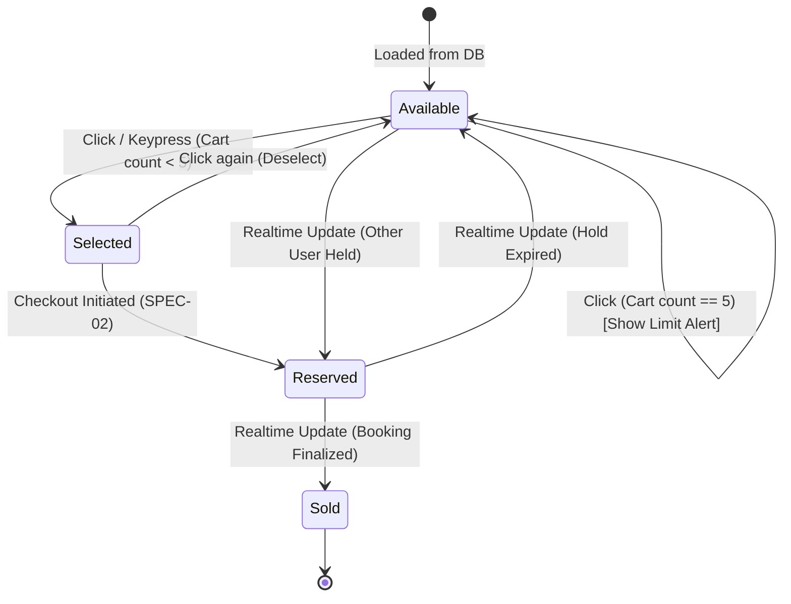

# SPEC-01: Interactive SVG Seating Map & Cart Summary

**Feature Code:** `FEAT-SEAT-01`  
**Parent Intent:** [`intent/interactive-event-ticketing.md`](file:///f:/SHADI/2-Programming/Interactive%20Event%20Ticketing%20Platform/interactive-event-ticketing-platform/intent/interactive-event-ticketing.md)  
**Parent Index:** [`docs/ai-sdlc/specs/README.md`](file:///f:/SHADI/2-Programming/Interactive%20Event%20Ticketing%20Platform/interactive-event-ticketing-platform/docs/ai-sdlc/specs/README.md)  
**Status:** Approved Specification  

---

## 1. Intent Sub-Traceability Matrix

| Requirement ID | Intent Line Reference | Description & Testable Boundary |
| :--- | :--- | :--- |
| `REQ-SEAT-01.1` | [L12](file:///f:/SHADI/2-Programming/Interactive%20Event%20Ticketing%20Platform/interactive-event-ticketing-platform/intent/interactive-event-ticketing.md#L12), [L31](file:///f:/SHADI/2-Programming/Interactive%20Event%20Ticketing%20Platform/interactive-event-ticketing-platform/intent/interactive-event-ticketing.md#L31), [L100-L103](file:///f:/SHADI/2-Programming/Interactive%20Event%20Ticketing%20Platform/interactive-event-ticketing-platform/intent/interactive-event-ticketing.md#L100-L103), [L160](file:///f:/SHADI/2-Programming/Interactive%20Event%20Ticketing%20Platform/interactive-event-ticketing-platform/intent/interactive-event-ticketing.md#L160) | **60fps SVG Seating Map:** Renders 500–1000 seats based on `layout_config` JSON. Supports multi-touch Pan & Pinch-to-Zoom without dropping below 60fps. |
| `REQ-SEAT-01.2` | [L101-L102](file:///f:/SHADI/2-Programming/Interactive%20Event%20Ticketing%20Platform/interactive-event-ticketing-platform/intent/interactive-event-ticketing.md#L101-L102) | **Render Optimization:** Individual seat items wrapped in `React.memo`. Tooltips driven by external cursor coordinates / pointer delegation to avoid SVG element re-renders. |
| `REQ-SEAT-01.3` | [L32-L34](file:///f:/SHADI/2-Programming/Interactive%20Event%20Ticketing%20Platform/interactive-event-ticketing-platform/intent/interactive-event-ticketing.md#L32-L34) | **Visual State Colors & Tooltip:** Seats display status colors (Green = Available, Blue = Selected, Orange = Reserved/Held, Gray = Sold). Hovering over available seats renders tooltip with Row, Seat Number, Category, and Price. |
| `REQ-SEAT-01.4` | [L36-L41](file:///f:/SHADI/2-Programming/Interactive%20Event%20Ticketing%20Platform/interactive-event-ticketing-platform/intent/interactive-event-ticketing.md#L36-L41) | **Selection & Cart Limits:** Clicking available seat toggles state to Selected (Blue). Updates live cart summary with seat count and subtotal. Disallows selecting > 5 seats, presenting an accessible inline warning. |
| `REQ-SEAT-01.5` | [L150](file:///f:/SHADI/2-Programming/Interactive%20Event%20Ticketing%20Platform/interactive-event-ticketing-platform/intent/interactive-event-ticketing.md#L150), [L174](file:///f:/SHADI/2-Programming/Interactive%20Event%20Ticketing%20Platform/interactive-event-ticketing-platform/intent/interactive-event-ticketing.md#L174) | **Flexible Venue JSON Layout:** Standardized JSON structure defining stage position, sections (VIP/Regular/Balcony), coordinates `(x, y)`, and tier default pricing. |

---

## 2. Venue Layout Model & Data Contract

Venues define seating topology using a declarative JSON structure (`venues.layout_config`):

```json
{
  "venueId": "00000000-0000-0000-0000-000000000001",
  "name": "Grand Symphony Hall",
  "viewBox": "0 0 1200 800",
  "stage": {
    "label": "STAGE / PERFORMANCE AREA",
    "x": 300,
    "y": 40,
    "width": 600,
    "height": 70
  },
  "sections": [
    {
      "id": "sec-vip",
      "name": "Orchestra VIP",
      "category": "VIP",
      "defaultPrice": 150.00,
      "colorTheme": "#10B981",
      "rows": [
        { "rowLabel": "A", "seats": 20, "startX": 200, "startY": 160, "spacing": 40 },
        { "rowLabel": "B", "seats": 20, "startX": 200, "startY": 200, "spacing": 40 },
        { "rowLabel": "C", "seats": 20, "startX": 200, "startY": 240, "spacing": 40 }
      ]
    },
    {
      "id": "sec-reg",
      "name": "Mezzanine Regular",
      "category": "Regular",
      "defaultPrice": 85.00,
      "colorTheme": "#3B82F6",
      "rows": [
        { "rowLabel": "D", "seats": 24, "startX": 120, "startY": 320, "spacing": 40 },
        { "rowLabel": "E", "seats": 24, "startX": 120, "startY": 360, "spacing": 40 },
        { "rowLabel": "F", "seats": 24, "startX": 120, "startY": 400, "spacing": 40 }
      ]
    },
    {
      "id": "sec-balc",
      "name": "Upper Balcony",
      "category": "Balcony",
      "defaultPrice": 45.00,
      "colorTheme": "#8B5CF6",
      "rows": [
        { "rowLabel": "G", "seats": 26, "startX": 80, "startY": 500, "spacing": 40 },
        { "rowLabel": "H", "seats": 26, "startX": 80, "startY": 540, "spacing": 40 }
      ]
    }
  ]
}
```

---

## 3. UI/UX & Interaction Architecture

### 3.1 Color Coding & Visual Tokens
- **Available (`available`):** Tailwind `emerald-500` (`#10B981`). Cursor `pointer`.
- **Selected (`selected`):** Tailwind `blue-600` (`#2563EB`). Cursor `pointer`.
- **Reserved / Held (`reserved`):** Tailwind `amber-500` (`#F59E0B`). Cursor `not-allowed`.
- **Sold / Booked (`sold`):** Tailwind `gray-400` (`#9CA3AF`). Cursor `not-allowed`.
- **Blocked / Unavailable (`unavailable`):** Tailwind `gray-200` (`#E5E7EB`). Cursor `not-allowed`.

### 3.2 Accessibility (a11y)
- Seat Grid container: `role="grid"` with `aria-label="Venue seating plan"`.
- Row groupings: `role="row"` with `aria-label="Row <label>"`.
- Individual seats: `<circle>` or `<rect>` with `role="gridcell"`, `tabIndex={isAvailable ? 0 : -1}`, and `aria-label="Seat <row><number>, Category: <category>, Price: $<price>, Status: <status>"`.
- Keyboard support: Arrow keys navigate between adjacent seats; `Enter` and `Space` toggle selection.

---

## 4. Finite State Machine: Seat Selection & Cart



### Transition Matrix

| Current State | Trigger Event | Guard Condition | Target State | UI / Cart Side Effect |
| :--- | :--- | :--- | :--- | :--- |
| `available` | `SEAT_CLICKED` | `selectedSeats.length < 5` | `selected` | Add seat to cart; recompute subtotal. |
| `available` | `SEAT_CLICKED` | `selectedSeats.length >= 5` | `available` | Retain state; display accessible toast/banner: *"Maximum 5 seats allowed per booking."* |
| `selected` | `SEAT_CLICKED` | In user's active session | `available` | Remove seat from cart; recompute subtotal. |
| `available` | `REALTIME_SEAT_UPDATE` | Payload `status == 'reserved'` | `reserved` | Disable pointer interactions; seat fill turns Orange. |
| `reserved` | `REALTIME_SEAT_UPDATE` | Payload `status == 'available'` | `available` | Re-enable pointer interactions; seat fill turns Green. |
| `reserved` | `REALTIME_SEAT_UPDATE` | Payload `status == 'sold'` | `sold` | Permanently disable interaction; seat fill turns Gray. |

---

## 5. Formal Acceptance Criteria (Gherkin Scenarios)

### Scenario 1.1: Visual rendering and tooltip inspection
```gherkin
Scenario: Attendee views available seats and inspects details via hover
  Given the attendee is on the event seat selection page for "Grand Symphony Concert"
  When the SVG venue map completes rendering
  Then all seats render with correct visual tokens:
    | Status    | Fill Color | Cursor Style |
    | available | #10B981    | pointer      |
    | reserved  | #F59E0B    | not-allowed  |
    | sold      | #9CA3AF    | not-allowed  |
  And hovering over available seat "A-12" renders a floating tooltip containing:
    | Field     | Value       |
    | Row       | A           |
    | Number    | 12          |
    | Category  | VIP         |
    | Price     | $150.00     |
  And moving the cursor off the seat removes the tooltip without triggering map re-renders
```

### Scenario 1.2: Valid seat selection and live cart aggregation
```gherkin
Scenario: Attendee selects multiple seats across different tiers
  Given the attendee has 0 seats in the cart
  When the attendee clicks on available VIP seat "A-1" priced at $150.00
  And the attendee clicks on available Regular seat "D-5" priced at $85.00
  Then both seats change visual fill to "#2563EB" (Selected)
  And the cart summary displays:
    | Field       | Value   |
    | Seat Count  | 2       |
    | Tier Items  | VIP (1), Regular (1) |
    | Subtotal    | $235.00 |
  And the "Proceed to Checkout" button is enabled
```

### Scenario 1.3: Enforcement of the 5-seat booking limit
```gherkin
Scenario: Attendee attempts to select a 6th seat
  Given the attendee currently has 5 seats selected in the cart
  When the attendee clicks on another available seat "E-10"
  Then seat "E-10" remains in "available" state with fill "#10B981"
  And the cart count remains 5 with subtotal unchanged
  And an accessible alert banner displays: "Maximum of 5 seats allowed per booking."
```

### Scenario 1.4: Deselection of seats
```gherkin
Scenario: Attendee deselects an already selected seat
  Given the attendee has selected seats "B-3" ($150) and "B-4" ($150) with subtotal $300.00
  When the attendee clicks on seat "B-4"
  Then seat "B-4" changes status to "available" with fill "#10B981"
  And the cart summary updates to:
    | Field      | Value   |
    | Seat Count | 1       |
    | Subtotal   | $150.00 |
```

---

## 6. Automated Verification Matrix

| Verification Target | Test Suite File | Test Execution Strategy | Assertions & Matchers |
| :--- | :--- | :--- | :--- |
| **SVG Layout & Seats Render** | `tests/components/SeatMap.test.jsx` | Mount `<SeatMap layout={mockLayout} seats={mockSeats} />` with React Testing Library. | `expect(screen.getAllByRole('gridcell')).toHaveLength(520);`<br>`expect(seatElement).toHaveAttribute('fill', '#10B981');` |
| **Tooltip Trigger (No Re-render)** | `tests/components/SeatMap.test.jsx` | Simulate `pointerOver` on seat element; check `renderCount` via profiling mock. | `expect(screen.getByRole('tooltip')).toHaveTextContent('VIP - $150.00');`<br>`expect(seatMapRenderSpy).toHaveBeenCalledTimes(1);` |
| **Cart Selection & Subtotal** | `tests/features/cart.test.jsx` | Click 2 seats sequentially within `<EventBookingPage />`. | `expect(screen.getByTestId('cart-seat-count')).toHaveTextContent('2');`<br>`expect(screen.getByTestId('cart-subtotal')).toHaveTextContent('$235.00');` |
| **5-Seat Boundary Enforcement** | `tests/features/cart.test.jsx` | Programmatically select 5 seats, then fire click on 6th seat. | `expect(screen.getByRole('alert')).toHaveTextContent('Maximum of 5 seats allowed');`<br>`expect(screen.getAllByTestId(/selected-seat-/)).toHaveLength(5);` |
| **Accessibility & Keyboard Navigation** | `tests/components/SeatMapA11y.test.jsx` | Focus on seat "A-1", fire `arrowRight` keyboard event, press `Enter`. | `expect(document.activeElement).toHaveAttribute('data-seat-id', 'A-2');`<br>`expect(screen.getByTestId('A-2')).toHaveAttribute('aria-selected', 'true');` |
