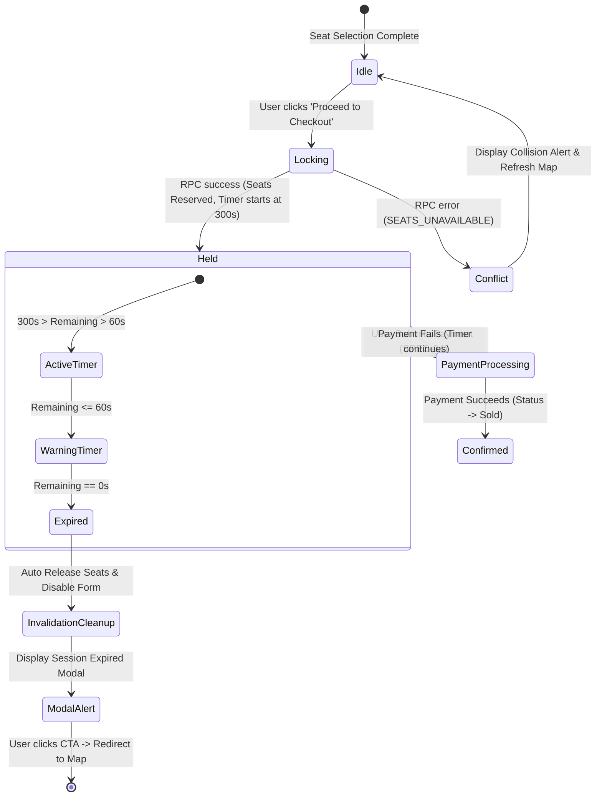

# SPEC-02: Concurrency Control, Realtime Sync & 5-Minute Hold Timer

**Feature Code:** `FEAT-HOLD-02`  
**Parent Intent:** [`intent/interactive-event-ticketing.md`](file:///f:/SHADI/2-Programming/Interactive%20Event%20Ticketing%20Platform/interactive-event-ticketing-platform/intent/interactive-event-ticketing.md)  
**Parent Index:** [`docs/ai-sdlc/specs/README.md`](file:///f:/SHADI/2-Programming/Interactive%20Event%20Ticketing%20Platform/interactive-event-ticketing-platform/docs/ai-sdlc/specs/README.md)  
**Status:** Approved Specification  

---

## 1. Intent Sub-Traceability Matrix

| Requirement ID | Intent Line Reference | Description & Testable Boundary |
| :--- | :--- | :--- |
| `REQ-HOLD-02.1` | [L49-L53](file:///f:/SHADI/2-Programming/Interactive%20Event%20Ticketing%20Platform/interactive-event-ticketing-platform/intent/interactive-event-ticketing.md#L49-L53), [L113-L145](file:///f:/SHADI/2-Programming/Interactive%20Event%20Ticketing%20Platform/interactive-event-ticketing-platform/intent/interactive-event-ticketing.md#L113-L145) | **Atomic Temporary Lock (RPC):** Calling `reserve_seats(eventId, seatIds, userId, 300)` locks all requested seats using PostgreSQL `FOR UPDATE`. If any seat is unavailable, transaction rolls back with an explicit exception. |
| `REQ-HOLD-02.2` | [L53](file:///f:/SHADI/2-Programming/Interactive%20Event%20Ticketing%20Platform/interactive-event-ticketing-platform/intent/interactive-event-ticketing.md#L53), [L111](file:///f:/SHADI/2-Programming/Interactive%20Event%20Ticketing%20Platform/interactive-event-ticketing-platform/intent/interactive-event-ticketing.md#L111) | **Realtime Seat Synchronization:** Broadcasts `UPDATE` events via Supabase Realtime channel `seats:event_id=eq.{eventId}`. Concurrent users' maps update seat status to `reserved` (Orange) within $\le 200\text{ms}$. |
| `REQ-HOLD-02.3` | [L54](file:///f:/SHADI/2-Programming/Interactive%20Event%20Ticketing%20Platform/interactive-event-ticketing-platform/intent/interactive-event-ticketing.md#L54), [L118](file:///f:/SHADI/2-Programming/Interactive%20Event%20Ticketing%20Platform/interactive-event-ticketing-platform/intent/interactive-event-ticketing.md#L118) | **300-Second Hold Countdown Timer:** Starts immediately upon entering checkout. Displays `MM:SS` format. Synchronizes against server `reserved_until` to eliminate client clock drift. |
| `REQ-HOLD-02.4` | [L56-L63](file:///f:/SHADI/2-Programming/Interactive%20Event%20Ticketing%20Platform/interactive-event-ticketing-platform/intent/interactive-event-ticketing.md#L56-L63), [L146](file:///f:/SHADI/2-Programming/Interactive%20Event%20Ticketing%20Platform/interactive-event-ticketing-platform/intent/interactive-event-ticketing.md#L146) | **Expiration Handshake & Cleanup:** Reaching `00:00` without payment marks the checkout invalid, releases seats back to `available` (Green), presents an inescapable "Session Expired" modal, and redirects back to the seating map. |

---

## 2. Technical Architecture & Protocols

### 2.1 Atomic Concurrency Protocol (`reserve_seats` RPC)

```sql
CREATE OR REPLACE FUNCTION reserve_seats(
  p_event_id UUID,
  p_seat_ids UUID[],
  p_user_id UUID,
  p_hold_duration_seconds INT DEFAULT 300
) RETURNS JSONB
LANGUAGE plpgsql
SECURITY DEFINER
AS $$
DECLARE
  v_available_count INT;
  v_expires_at TIMESTAMPTZ;
BEGIN
  v_expires_at := NOW() + (p_hold_duration_seconds || ' seconds')::INTERVAL;

  -- 1. Acquire pessimistic row-level lock on available seats matching IDs
  PERFORM id FROM seats
  WHERE id = ANY(p_seat_ids)
    AND event_id = p_event_id
    AND status = 'available'
  FOR UPDATE;

  -- 2. Verify all requested seats were successfully locked
  SELECT COUNT(*) INTO v_available_count
  FROM seats
  WHERE id = ANY(p_seat_ids)
    AND event_id = p_event_id
    AND status = 'available';

  IF v_available_count <> array_length(p_seat_ids, 1) THEN
    RETURN jsonb_build_object(
      'success', false,
      'error_code', 'SEATS_UNAVAILABLE',
      'message', 'One or more requested seats are no longer available.'
    );
  END IF;

  -- 3. Transition status to reserved
  UPDATE seats
  SET status = 'reserved',
      reserved_by = p_user_id,
      reserved_until = v_expires_at,
      updated_at = NOW()
  WHERE id = ANY(p_seat_ids);

  RETURN jsonb_build_object(
    'success', true,
    'reserved_seat_ids', p_seat_ids,
    'reserved_until', v_expires_at
  );
END;
$$;
```

### 2.2 Realtime Subscription Protocol
Frontend components listen to Supabase Realtime postgres changes:
```typescript
const channel = supabase
  .channel(`event-seats-${eventId}`)
  .on(
    'postgres_changes',
    {
      event: 'UPDATE',
      schema: 'public',
      table: 'seats',
      filter: `event_id=eq.${eventId}`
    },
    (payload) => {
      handleSeatStateUpdate(payload.new as SeatRecord);
    }
  )
  .subscribe();
```

### 2.3 Expiration Handshake Protocol
1. **Client Clock Drift Protection:** The timer computes remaining duration from `Date.parse(reserved_until) - Date.now()`.
2. **Visual Urgency Trigger:** When remaining time $\le 60$ seconds, timer turns red (`text-rose-600`) and pulses.
3. **Expiration at 00:00:**
   - Triggers `releaseSeats(eventId, seatIds, userId)` RPC call.
   - Clears local booking state.
   - Disables all form inputs in checkout view.
   - Renders blocking `<SessionExpiredModal />`.
   - On CTA click ("Choose Other Seats"), navigates to `/events/:id/seats`.

---

## 3. Finite State Machine: Concurrency & Hold Timer



### State Transition Table

| Current State | Trigger | Condition | Next State | Action / Event |
| :--- | :--- | :--- | :--- | :--- |
| `Idle` | `PROCEED_TO_CHECKOUT` | User selected 1–5 seats | `Locking` | Invoke `reserve_seats()` RPC. |
| `Locking` | `RPC_SUCCESS` | All seats available | `Held.ActiveTimer` | Set `reserved_until`; launch 300s countdown timer. |
| `Locking` | `RPC_FAILURE` | Any seat already held | `Conflict` | Show alert: *"Seats recently reserved by another user."* |
| `Held.ActiveTimer` | `TICK` | Remaining $\le 60\text{s}$ | `Held.WarningTimer` | Apply alert styling; trigger audible/visual warning. |
| `Held.WarningTimer`| `TICK` | Remaining $\le 0\text{s}$ | `Expired` | Invalidate session; release seats; render modal. |
| `Held` | `SUBMIT_PAYMENT` | Form valid | `PaymentProcessing`| Disable inputs; call `confirmBooking()` (SPEC-04). |
| `PaymentProcessing`| `PAYMENT_SUCCESS` | Gateway 200 OK | `Confirmed` | Seats marked `sold`; route to Ticket Receipt. |
| `PaymentProcessing`| `PAYMENT_FAILURE` | Gateway 4xx/5xx | `Held` | Enable inputs; display payment error message. |

---

## 4. Formal Acceptance Criteria (Gherkin Scenarios)

### Scenario 2.1: Successful atomic lock and timer initiation
```gherkin
Scenario: Attendee proceeds to checkout and acquires temporary hold
  Given the attendee has selected 2 available seats ("A-1", "A-2")
  When the attendee clicks "Proceed to Checkout"
  Then the system invokes the atomic "reserve_seats" RPC for both seats
  And the seats transition to "reserved" in the database with a 300-second expiration timestamp
  And a Realtime update broadcasts to all other users showing seats "A-1" and "A-2" as "reserved" (#F59E0B)
  And the attendee's view transitions to checkout with an active 05:00 countdown timer
```

### Scenario 2.2: Concurrency collision handling
```gherkin
Scenario: Simultaneous checkout attempt on overlapping seats
  Given attendee "Alice" and attendee "Bob" both selected seat "A-1"
  When "Alice" clicks "Proceed to Checkout" 50ms before "Bob"
  Then "Alice" acquires the lock and transitions to checkout
  And "Bob"'s request receives error "SEATS_UNAVAILABLE"
  And "Bob" remains on the seating map
  And seat "A-1" turns Orange (#F59E0B) on "Bob"'s screen
  And "Bob" sees an inline alert: "Seat A-1 was just reserved by another attendee. Please select another seat."
```

### Scenario 2.3: Precision countdown countdown and 60-second warning
```gherkin
Scenario: Timer countdown reflects elapsed time and displays warning
  Given the attendee is on checkout with 300 seconds initial hold
  When 240 seconds elapse
  Then the countdown timer displays "01:00"
  And the timer visual style changes to warning color (#E11D48 / text-rose-600)
  And an accessible screen-reader announcement fires: "1 minute remaining to complete your booking"
```

### Scenario 2.4: Timer expiration handshake and seat release
```gherkin
Scenario: Hold timer expires at 00:00 without payment
  Given the attendee has seats "B-5", "B-6" on hold on the checkout view
  When the timer reaches "00:00"
  Then the checkout session is automatically invalidated
  And the system invokes release of seats "B-5" and "B-6" back to "available"
  And all payment inputs and submission buttons are disabled
  And a modal titled "Session Expired" appears displaying:
    """
    Your 5-minute reservation hold has expired. The seats have been released back to the event map.
    """
  When the attendee clicks "Return to Seat Map" in the modal
  Then the attendee is navigated back to the event seating page
  And seats "B-5" and "B-6" are visible as Green ("available")
```

---

## 5. Automated Verification Matrix

| Verification Target | Test Suite File | Test Execution Strategy | Assertions & Matchers |
| :--- | :--- | :--- | :--- |
| **Atomic Lock RPC Call** | `tests/features/seat-hold.test.js` | Mock `ITicketingService.reserveSeats` to return `success: true`. | `expect(reserveSeatsMock).toHaveBeenCalledWith('event-1', ['s1', 's2'], 'user-1', 300);` |
| **Collision Rejection** | `tests/features/seat-hold.test.js` | Mock `reserveSeats` returning `SEATS_UNAVAILABLE`. | `expect(screen.getByRole('alert')).toHaveTextContent('no longer available');`<br>`expect(screen.getByTestId('seat-s1')).toHaveAttribute('fill', '#F59E0B');` |
| **Realtime Channel Subscription** | `tests/integration/realtime.test.js` | Simulate incoming WebSocket message `{ id: 's1', status: 'reserved' }`. | `await waitFor(() => expect(screen.getByTestId('seat-s1')).toHaveAttribute('data-status', 'reserved'));` |
| **Timer Decrement via Fake Timers** | `tests/features/hold-timer.test.jsx` | Use `vi.useFakeTimers()`; advance timer by 60 seconds (`vi.advanceTimersByTime(60000)`). | `expect(screen.getByTestId('hold-countdown')).toHaveTextContent('04:00');` |
| **Warning at 60s** | `tests/features/hold-timer.test.jsx` | Advance fake timers by 241 seconds (`vi.advanceTimersByTime(241000)`). | `expect(screen.getByTestId('hold-countdown')).toHaveClass('text-rose-600');` |
| **Expiration Handshake at 00:00** | `tests/features/hold-timer.test.jsx` | Advance fake timers by 300,000ms. | `expect(screen.getByRole('dialog')).toHaveTextContent('Session Expired');`<br>`expect(releaseSeatsMock).toHaveBeenCalledTimes(1);`<br>`expect(screen.getByRole('button', { name: /Pay/i })).toBeDisabled();` |
