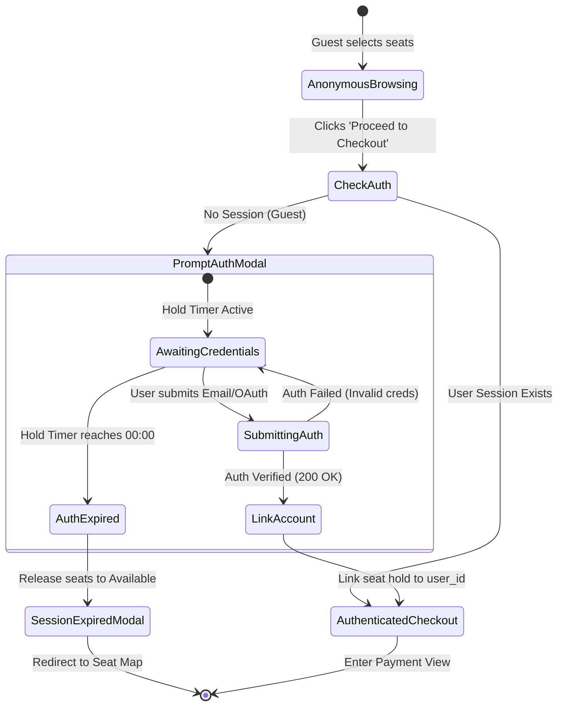

# SPEC-03: Smart Frictionless Authentication & Session Retention

**Feature Code:** `FEAT-AUTH-03`  
**Parent Intent:** [`intent/interactive-event-ticketing.md`](file:///f:/SHADI/2-Programming/Interactive%20Event%20Ticketing%20Platform/interactive-event-ticketing-platform/intent/interactive-event-ticketing.md)  
**Parent Index:** [`docs/ai-sdlc/specs/README.md`](file:///f:/SHADI/2-Programming/Interactive%20Event%20Ticketing%20Platform/interactive-event-ticketing-platform/docs/ai-sdlc/specs/README.md)  
**Status:** Approved Specification  

---

## 1. Intent Sub-Traceability Matrix

| Requirement ID | Intent Line Reference | Description & Testable Boundary |
| :--- | :--- | :--- |
| `REQ-AUTH-03.1` | [L12](file:///f:/SHADI/2-Programming/Interactive%20Event%20Ticketing%20Platform/interactive-event-ticketing-platform/intent/interactive-event-ticketing.md#L12), [L69](file:///f:/SHADI/2-Programming/Interactive%20Event%20Ticketing%20Platform/interactive-event-ticketing-platform/intent/interactive-event-ticketing.md#L69), [L71-L74](file:///f:/SHADI/2-Programming/Interactive%20Event%20Ticketing%20Platform/interactive-event-ticketing-platform/intent/interactive-event-ticketing.md#L71-L74), [L162](file:///f:/SHADI/2-Programming/Interactive%20Event%20Ticketing%20Platform/interactive-event-ticketing-platform/intent/interactive-event-ticketing.md#L162) | **Checkout Boundary Authentication:** Public visitors browse events and select seats without credentials. Authentication (Email + OAuth) is triggered only when the unauthenticated visitor clicks "Proceed to Checkout". |
| `REQ-AUTH-03.2` | [L75-L77](file:///f:/SHADI/2-Programming/Interactive%20Event%20Ticketing%20Platform/interactive-event-ticketing-platform/intent/interactive-event-ticketing.md#L75-L77) | **State & Seat Selection Retention:** Selected seat IDs and active hold identifiers are preserved in `sessionStorage` or application context across auth transitions. Post-auth callback transfers reservation ownership to `auth.users.id` without losing seat selections or resetting the 300s timer. |
| `REQ-AUTH-03.3` | [L56-L63](file:///f:/SHADI/2-Programming/Interactive%20Event%20Ticketing%20Platform/interactive-event-ticketing-platform/intent/interactive-event-ticketing.md#L56-L63), [L71-L77](file:///f:/SHADI/2-Programming/Interactive%20Event%20Ticketing%20Platform/interactive-event-ticketing-platform/intent/interactive-event-ticketing.md#L71-L77) | **Auth Modal Expiration Edge Case:** If the 300s hold countdown timer expires while the attendee is still actively viewing or submitting the Auth modal, the auth form is disabled, seats are released to `available`, and the modal transitions immediately to the "Session Expired" notification. |

---

## 2. Architectural Design & State Retention

### 2.1 Boundary Gate & Auth Handshake
When an anonymous visitor proceeds from the seating map:
1. System checks `supabase.auth.getSession()`.
2. If authenticated: proceeds directly to payment screen with user credentials.
3. If unauthenticated:
   - Persists checkout payload to `sessionStorage.getItem('pending_booking')`:
     ```json
     {
       "eventId": "event-123",
       "seatIds": ["seat-1", "seat-2"],
       "reservedUntil": "2026-10-03T07:35:00.000Z",
       "subtotal": 170.00
     }
     ```
   - Opens quick `<AuthModal />` with Email/Password tab and OAuth buttons (Google, GitHub).

### 2.2 Account Linkage Post-Auth
Upon successful login or sign-up:
1. `onAuthStateChange` receives authenticated `user`.
2. Invokes transfer RPC or updates `seats.reserved_by = user.id` for the reserved seats.
3. Closes `<AuthModal />` without redirecting away from the checkout process.
4. Auto-fills attendee name and email into payment summary.

### 2.3 Expiration During Auth Modal
The countdown timer component remains mounted and visible in the `<AuthModal />` header:
- If remaining time reaches $0$:
  - Clears `pending_booking` from `sessionStorage`.
  - Fires `releaseSeats()`.
  - Replaces auth inputs with "Reservation Expired" CTA.

---

## 3. Finite State Machine: Auth Boundary & Retention



### Transition Matrix

| Current State | Trigger | Condition | Next State | Action / Data Update |
| :--- | :--- | :--- | :--- | :--- |
| `AnonymousBrowsing` | `PROCEED_CLICK` | `user == null` | `PromptAuthModal` | Save `pending_booking` to storage; show modal with active timer. |
| `PromptAuthModal` | `AUTH_SUCCESS` | Remaining time $> 0$ | `LinkAccount` | Link `reserved_by = user.id`; transfer session. |
| `LinkAccount` | `LINK_COMPLETE` | Seats still reserved | `AuthenticatedCheckout`| Transition directly to payment screen with user info. |
| `PromptAuthModal` | `TIMER_ZERO` | Remaining time $\le 0$ | `AuthExpired` | Disable auth inputs; call `releaseSeats()`; show expiration alert. |
| `PromptAuthModal` | `MODAL_DISMISSED` | Remaining time $> 0$ | `AnonymousBrowsing` | Keep seats selected in cart; retain timer until expiry. |

---

## 4. Formal Acceptance Criteria (Gherkin Scenarios)

### Scenario 3.1: Frictionless authentication prompt at checkout boundary
```gherkin
Scenario: Guest attendee prompted to authenticate only at checkout
  Given an unauthenticated visitor has selected 2 VIP seats ($300.00 total)
  When the visitor clicks "Proceed to Checkout"
  Then the system displays the "Sign In to Complete Booking" modal
  And the modal displays the active hold countdown timer "04:58"
  And the modal offers tabs for "Sign In", "Sign Up", and "Continue with Google"
  And the seats remain locked for the visitor during this interaction
```

### Scenario 3.2: State retention and seamless progression post-login
```gherkin
Scenario: Attendee logs in and advances without losing selected seats
  Given the visitor is on the "Sign In to Complete Booking" modal with seats "C-1", "C-2" held
  When the visitor signs in successfully with email "attendee@example.com"
  Then the modal closes automatically
  And the system links seats "C-1" and "C-2" to the authenticated account
  And the attendee lands on Step 2 ("Payment") of checkout
  And seats "C-1" and "C-2" and subtotal "$300.00" are preserved without reset
  And the countdown timer continues counting down from the original expiration timestamp
```

### Scenario 3.3: Hold timer expiration while Auth modal is open
```gherkin
Scenario: Reservation timer reaches 00:00 while attendee is completing sign-in
  Given the visitor is on the checkout auth modal with seats "D-4", "D-5"
  And the countdown timer reaches "00:00"
  When the timer expires
  Then all input fields (email, password, OAuth buttons) in the modal are disabled
  And an alert displays within the modal:
    """
    Your reservation hold has expired. The seats have been released.
    """
  And the system invokes release of seats "D-4" and "D-5" back to "available"
  And clicking the "Back to Map" button dismisses the modal and navigates to the event seat map
```

---

## 5. Automated Verification Matrix

| Verification Target | Test Suite File | Test Execution Strategy | Assertions & Matchers |
| :--- | :--- | :--- | :--- |
| **Boundary Trigger on Checkout** | `tests/features/auth-boundary.test.jsx` | Mount `<CheckoutFlow />` with mock `user = null`. Click Proceed. | `expect(screen.getByRole('dialog')).toHaveTextContent('Sign In to Complete Booking');` |
| **Session Retention via Storage** | `tests/features/auth-boundary.test.jsx` | Verify `sessionStorage` write before opening modal. | `const stored = JSON.parse(sessionStorage.getItem('pending_booking'));`<br>`expect(stored.seatIds).toEqual(['s1', 's2']);` |
| **Seamless Transition Post-Auth** | `tests/features/auth-boundary.test.jsx` | Simulate `supabase.auth.signInWithPassword` resolving `user = { id: 'u123' }`. | `await waitFor(() => expect(screen.queryByRole('dialog')).not.toBeInTheDocument());`<br>`expect(screen.getByTestId('checkout-step-payment')).toBeInTheDocument();`<br>`expect(screen.getByTestId('cart-subtotal')).toHaveTextContent('$300.00');` |
| **Auth Timeout Edge Case** | `tests/features/auth-boundary-timeout.test.jsx` | Open auth modal; advance fake timers by 300s (`vi.advanceTimersByTime(300000)`). | `expect(screen.getByText(/Your reservation hold has expired/i)).toBeInTheDocument();`<br>`expect(screen.getByRole('button', { name: /Sign In/i })).toBeDisabled();`<br>`expect(releaseSeatsMock).toHaveBeenCalled();` |
