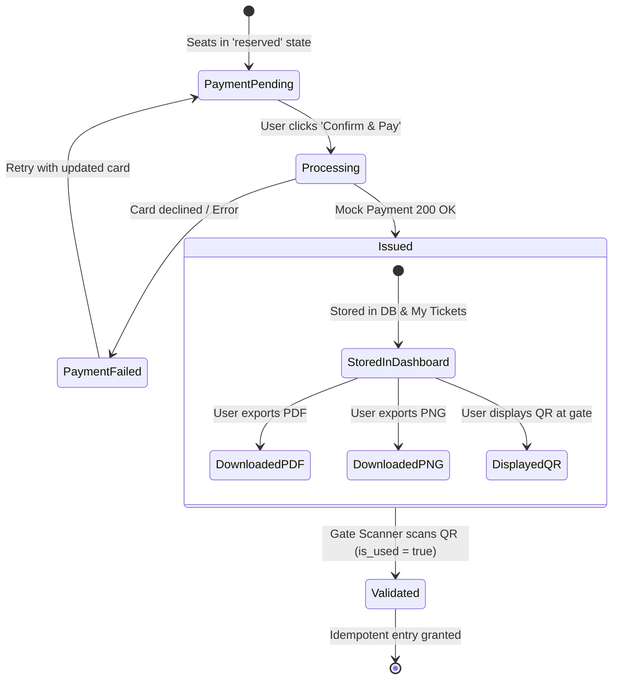

# SPEC-04: Digital Ticket Issuance, Signed QR Codes & Export

**Feature Code:** `FEAT-TICK-04`  
**Parent Intent:** [`intent/interactive-event-ticketing.md`](file:///f:/SHADI/2-Programming/Interactive%20Event%20Ticketing%20Platform/interactive-event-ticketing-platform/intent/interactive-event-ticketing.md)  
**Parent Index:** [`docs/ai-sdlc/specs/README.md`](file:///f:/SHADI/2-Programming/Interactive%20Event%20Ticketing%20Platform/interactive-event-ticketing-platform/docs/ai-sdlc/specs/README.md)  
**Status:** Approved Specification  

---

## 1. Intent Sub-Traceability Matrix

| Requirement ID | Intent Line Reference | Description & Testable Boundary |
| :--- | :--- | :--- |
| `REQ-TICK-04.1` | [L17](file:///f:/SHADI/2-Programming/Interactive%20Event%20Ticketing%20Platform/interactive-event-ticketing-platform/intent/interactive-event-ticketing.md#L17), [L85-L88](file:///f:/SHADI/2-Programming/Interactive%20Event%20Ticketing%20Platform/interactive-event-ticketing-platform/intent/interactive-event-ticketing.md#L85-L88), [L152](file:///f:/SHADI/2-Programming/Interactive%20Event%20Ticketing%20Platform/interactive-event-ticketing-platform/intent/interactive-event-ticketing.md#L152), [L163](file:///f:/SHADI/2-Programming/Interactive%20Event%20Ticketing%20Platform/interactive-event-ticketing-platform/intent/interactive-event-ticketing.md#L163) | **Mock Checkout & Sold Transition:** Submitting valid mock payment details updates booking to `confirmed` and permanently updates associated seat records to `sold` (Gray / `#9CA3AF`). |
| `REQ-TICK-04.2` | [L12](file:///f:/SHADI/2-Programming/Interactive%20Event%20Ticketing%20Platform/interactive-event-ticketing-platform/intent/interactive-event-ticketing.md#L12), [L89](file:///f:/SHADI/2-Programming/Interactive%20Event%20Ticketing%20Platform/interactive-event-ticketing-platform/intent/interactive-event-ticketing.md#L89), [L105](file:///f:/SHADI/2-Programming/Interactive%20Event%20Ticketing%20Platform/interactive-event-ticketing-platform/intent/interactive-event-ticketing.md#L105), [L153](file:///f:/SHADI/2-Programming/Interactive%20Event%20Ticketing%20Platform/interactive-event-ticketing-platform/intent/interactive-event-ticketing.md#L153) | **Digitally Signed QR Code:** Generates high-contrast QR code (`qrcode.react`) embedding an HMAC-SHA256 signature payload. Verifiable tamper-proof structure. |
| `REQ-TICK-04.3` | [L19](file:///f:/SHADI/2-Programming/Interactive%20Event%20Ticketing%20Platform/interactive-event-ticketing-platform/intent/interactive-event-ticketing.md#L19), [L153](file:///f:/SHADI/2-Programming/Interactive%20Event%20Ticketing%20Platform/interactive-event-ticketing-platform/intent/interactive-event-ticketing.md#L153) | **Gate Validator Readiness:** Ticket database model stores `is_used` (boolean) and `scanned_at` (timestamp) fields to support idempotent verification by gate scanners. |
| `REQ-TICK-04.4` | [L12](file:///f:/SHADI/2-Programming/Interactive%20Event%20Ticketing%20Platform/interactive-event-ticketing-platform/intent/interactive-event-ticketing.md#L12), [L90](file:///f:/SHADI/2-Programming/Interactive%20Event%20Ticketing%20Platform/interactive-event-ticketing-platform/intent/interactive-event-ticketing.md#L90), [L106-L107](file:///f:/SHADI/2-Programming/Interactive%20Event%20Ticketing%20Platform/interactive-event-ticketing-platform/intent/interactive-event-ticketing.md#L106-L107), [L164](file:///f:/SHADI/2-Programming/Interactive%20Event%20Ticketing%20Platform/interactive-event-ticketing-platform/intent/interactive-event-ticketing.md#L164) | **Client-Side PDF & PNG Export:** Instant downloadable digital passes generated directly in the browser via `jspdf` and `html-to-image` without third-party email dependencies. |
| `REQ-TICK-04.5` | [L17](file:///f:/SHADI/2-Programming/Interactive%20Event%20Ticketing%20Platform/interactive-event-ticketing-platform/intent/interactive-event-ticketing.md#L17), [L91](file:///f:/SHADI/2-Programming/Interactive%20Event%20Ticketing%20Platform/interactive-event-ticketing-platform/intent/interactive-event-ticketing.md#L91), [L162](file:///f:/SHADI/2-Programming/Interactive%20Event%20Ticketing%20Platform/interactive-event-ticketing-platform/intent/interactive-event-ticketing.md#L162) | **"My Tickets" Dashboard:** Responsive dashboard where authenticated attendees view upcoming and past tickets, launch QR modals, and re-download passes offline. |

---

## 2. Technical Architecture & Cryptographic Design

### 2.1 QR Code Payload & HMAC-SHA256 Signing
The QR code encodes a compact JSON or URL string containing canonical metadata and a digital signature:

```json
{
  "tid": "tkt_98765432-abcd",
  "bid": "bk_12345678-efgh",
  "eid": "evt_symphony_2026",
  "sid": "seat_A12",
  "tier": "VIP",
  "iat": 1790998800,
  "sig": "e3b0c44298fc1c149afbf4c8996fb92427ae41e4649b934ca495991b7852b855"
}
```

#### Cryptographic Architecture & Environment Demarcation:
- **Frontend MVP / Mock Mode:** Cryptographic signature is generated using a dedicated utility `signTicketPayload(payload, mockSecret)` using Web Crypto API (`crypto.subtle`) or a lightweight HMAC-SHA256 digest function.
- **Production Supabase Integration:** The private HMAC signing secret (`TICKET_HMAC_SECRET`) is stored strictly in Supabase Vault / Edge Function Environment Variables. Tickets are signed server-side inside the `confirm_booking` Edge Function before returning to the frontend.

### 2.2 Client-Side Export Pipeline
1. **Pass Layout Container:** A hidden or dedicated `<TicketPassView ref={ticketPassRef} ticket={ticket} />` styled with ticket card aesthetics (Event Banner, Date, Venue, Section/Row/Seat, Attendee Name, and QR Code).
2. **PNG Export:**
   ```typescript
   import { toPng } from 'html-to-image';
   const dataUrl = await toPng(ticketPassRef.current, { quality: 0.95, pixelRatio: 2 });
   // Triggers browser anchor download: `Ticket-${ticket.ticket_code}.png`
   ```
3. **PDF Export:**
   ```typescript
   import { jsPDF } from 'jspdf';
   const doc = new jsPDF({ orientation: 'portrait', unit: 'mm', format: 'a5' });
   // Renders header, ticket graphics, and embeds generated QR image
   doc.save(`Ticket-${ticket.ticket_code}.pdf`);
   ```

---

## 3. Finite State Machine: Ticket Lifecycle



### Transition Table

| Current State | Trigger | Condition | Next State | Action / Data Update |
| :--- | :--- | :--- | :--- | :--- |
| `PaymentPending` | `SUBMIT_PAYMENT` | Card details valid | `Processing` | Call `confirmBooking()` RPC. |
| `Processing` | `RPC_SUCCESS` | Seats locked | `Issued` | Mark seats `sold`; generate HMAC signature; create ticket records. |
| `Processing` | `RPC_FAILURE` | Hold expired during checkout | `PaymentFailed` | Show expired error; release seats. |
| `Issued` | `EXPORT_REQUEST` | Type == 'PDF' \|\| 'PNG' | `Issued` | Render client canvas; trigger file download. |
| `Issued` | `GATE_SCAN` | `is_used == false` | `Validated` | Set `is_used = true`, `scanned_at = NOW()`; permit entry. |
| `Validated` | `GATE_SCAN` | `is_used == true` | `Validated` | Reject entry: *"Ticket already scanned at [scanned_at]"*. |

---

## 4. Formal Acceptance Criteria (Gherkin Scenarios)

### Scenario 4.1: Mock payment completion and seat status update to Sold
```gherkin
Scenario: Attendee completes mock checkout successfully
  Given the attendee has 2 reserved seats ("A-1", "A-2") with active hold
  When the attendee enters mock card "4242 4242 4242 4242", expiry "12/28", CVC "123"
  And clicks "Confirm & Pay $300.00"
  Then the system completes the transaction
  And seats "A-1" and "A-2" permanently transition to status "sold" (#9CA3AF)
  And 2 digital ticket records are generated with unique ticket codes
  And the attendee is redirected to the "Booking Confirmed" receipt page
```

### Scenario 4.2: Cryptographic QR code generation and inspection
```gherkin
Scenario: Generated ticket displays tamper-proof signed QR code
  Given a confirmed ticket "TKT-10029" for seat "A-1"
  When the attendee views the digital ticket receipt
  Then a QR code renders prominently on the ticket pass
  And scanning or decoding the QR code payload yields:
    | Property | Expected Type |
    | tid      | String (UUID) |
    | eid      | String (UUID) |
    | sid      | String (UUID) |
    | tier     | "VIP"         |
    | sig      | Hex String (64 chars HMAC-SHA256) |
```

### Scenario 4.3: Direct client-side ticket export as PDF and PNG
```gherkin
Scenario: Attendee downloads ticket pass without email dependency
  Given the attendee is on the ticket details view for "TKT-10029"
  When the attendee clicks "Download PDF"
  Then the browser initiates a download for "Ticket-TKT-10029.pdf"
  And the PDF contains event title, date, seat details, and high-resolution QR graphic
  When the attendee clicks "Download PNG"
  Then the browser initiates a download for "Ticket-TKT-10029.png"
  And the PNG renders cleanly at 2x pixel density
```

### Scenario 4.4: "My Tickets" dashboard retrieval and gate readiness
```gherkin
Scenario: Authenticated attendee retrieves purchased tickets
  Given the attendee has previously purchased 3 tickets across 2 bookings
  When the attendee navigates to "/my-tickets"
  Then the dashboard renders 3 ticket cards grouped by event
  And each card displays seat identifier, tier badge, and a "Show QR Pass" button
  And clicking "Show QR Pass" displays the full-screen QR modal with brightness boost
```

---

## 5. Automated Verification Matrix

| Verification Target | Test Suite File | Test Execution Strategy | Assertions & Matchers |
| :--- | :--- | :--- | :--- |
| **Mock Checkout & Sold Status** | `tests/features/ticket-issuance.test.js` | Call `confirmBooking` on `ITicketingService`. | `const res = await service.confirmBooking(bookingId, paymentData);`<br>`expect(res.status).toBe('confirmed');`<br>`expect(res.seats[0].status).toBe('sold');` |
| **HMAC-SHA256 Signature Validity** | `tests/unit/qr-signer.test.js` | Generate signature; verify signature using standard HMAC key. | `const { payload, sig } = signTicket(mockTicket);`<br>`expect(verifyTicket(payload, sig)).toBe(true);`<br>`expect(verifyTicket({ ...payload, tier: 'Regular' }, sig)).toBe(false);` |
| **PDF Generation Execution** | `tests/features/ticket-export.test.jsx` | Mock `jsPDF.prototype.save`. Click "Download PDF". | `fireEvent.click(screen.getByRole('button', { name: /Download PDF/i }));`<br>`expect(jsPdfSaveMock).toHaveBeenCalledWith('Ticket-TKT-10029.pdf');` |
| **PNG Generation Execution** | `tests/features/ticket-export.test.jsx` | Mock `html-to-image.toPng`. Click "Download PNG". | `fireEvent.click(screen.getByRole('button', { name: /Download PNG/i }));`<br>`expect(toPngMock).toHaveBeenCalled();` |
| **My Tickets List Rendering** | `tests/features/my-tickets.test.jsx` | Render `<MyTicketsPage />` with 2 mock tickets. | `expect(screen.getAllByTestId('ticket-card')).toHaveLength(2);`<br>`expect(screen.getByText('Seat A-1 (VIP)')).toBeInTheDocument();` |
